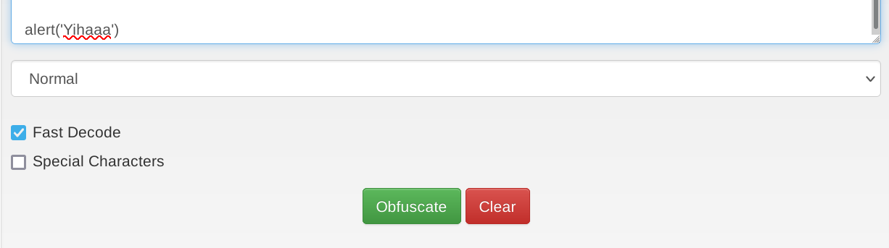
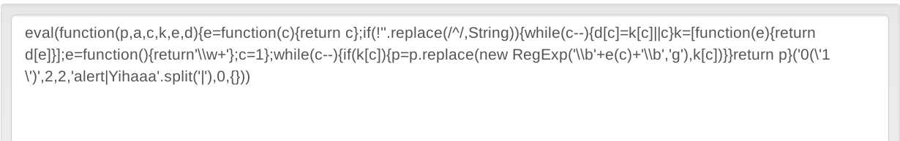

# JavaScript Deobfuscation

## Introduction

A website usually consist of `HTML` (structure), `CSS` (design) and `JavaScript` (functionality). Since the source of a website is publicly visible, developer use to obfuscate the source. Especially the JavaScript part is a good target to obfuscate and hide the true intentions behind the code.

Let's see an example:

```html
</html>
<!DOCTYPE html>

<head>
    <title>Secret Serial Generator</title>
    <style>
        *,
        html {
            margin: 0;
            padding: 0;
            border: 0;
        }

        html {
            width: 100%;
            height: 100%;
        }

        body {
            width: 100%;
            height: 100%;
            position: relative;
            background-color: #6fb3eb;
        }

        .center {
            width: 100%;
            height: 50%;
            margin: 0;
            position: absolute;
            top: 50%;
            left: 50%;
            transform: translate(-50%, -50%);
            color: white;
            font-family: "Helvetica", Helvetica, sans-serif;
            text-align: center;
        }

        h1 {
            font-size: 144px;
        }

        p {
            font-size: 64px;
        }
    </style>
    <script src="secret.js"></script>
    <!-- HTB{4lw4y5_r34d_7h3_50urc3} -->
</head>

<body>
    <div class="center">
        <h1>Secret Serial Generator</h1>
        <p>This page generates secret serials!</p>
    </div>
</body>

</html>
```

CSS can bi external in a link or, as it is here, in-line (between \<style\> tags). 

On line ### we can see a link to a JavaScript file. Examining the file we get

```javascript
eval(function (p, a, c, k, e, d) { e = function (c) { return c.toString(36) }; if (!''.replace(/^/, String)) { while (c--) { d[c.toString(a)] = k[c] || c.toString(a) } k = [function (e) { return d[e] }]; e = function () { return '\\w+' }; c = 1 }; while (c--) { if (k[c]) { p = p.replace(new RegExp('\\b' + e(c) + '\\b', 'g'), k[c]) } } return p }('g 4(){0 5="6{7!}";0 1=8 a();0 2="/9.c";1.d("e",2,f);1.b(3)}', 17, 17, 'var|xhr|url|null|generateSerial|flag|HTB|1_4m_7h3_53r14l_g3n3r470r|new|serial|XMLHttpRequest|send|php|open|POST|true|function'.split('|'), 0, {}))
```

It's obfuscated and to see what the script is really doing we need to deobfuscate it. 

## Code Obfuscation

### What is obfuscation

Obfuscation is a technique to make code harder to read (for humans). It has to retain the same functionality.
One technique used is to turn words or letters and symbols into dictionary elements and on execution a function recreates the code.

We can try a simple dictionary obfuscation on the site [http://beautifytools.com/javascript-obfuscator.php](http://beautifytools.com/javascript-obfuscator.php)



And the obfuscated result:




### Basic obfuscation

#### Code Minification

One way to reduce readability of the code is to `minify` it. `Code minification ` is the process to put the code in one single line. It's more useful for longer code. Short code is easy readable without de-minifying it. 
Here is an example of a minified function in JavaScript. The tool used is [https://javascript-minifier.com](https://javascript-minifier.com).

The original function is: 

```javascript
function displayLog(){
	console.log('Displaying the log on the console';
}
```

The minified result:

```javascript
function displayLog(){console.log("Displaying the log on the console")}
```

#### Code Packing

The next step is to pack the "one-liner". Using again [BeautifyTools](http://beautifytools.com/javascript-obfuscator.php), we get:

```javascript
eval(function(p,a,c,k,e,d){e=function(c){return c};if(!''.replace(/^/,String)){while(c--){d[c]=k[c]||c}k=[function(e){return d[e]}];e=function(){return'\\w+'};c=1};while(c--){if(k[c]){p=p.replace(new RegExp('\\b'+e(c)+'\\b','g'),k[c])}}return p}('3 4(){0.1("5 2 1 6 2 0")}',7,7,'console|log|the|function|displayLog|Displaying|on'.split('|'),0,{}))
```

The functionality is the same but it's a lot harder to figure out what the code does.

!!! note 
    The above type of obfuscation is known as "packing", which is  usually recognizable from the six function arguments used in the initial function "function(p,a,c,k,e,d)".

The code is very hard to read, but we can still see keywords in the text. Would there be a password or username embedded, we could easily identify that.

#### Advanced Obfuscation

To get rid of the strings that are still in clear text, we need to run further obfuscation, like converting the strings to `base64`,  normal or inverted string arrays and other methods. A great tool for that is [https://obfuscator.io/](https://obfuscator.io/). We can simply add the code as we would write it and the tool takes care of minification and packing if needed.

```javascript
function displayLog(){
	console.log('Displaying the log on the console');
}
```

If we change the string encoding to `base64`, we get this result. 

```javascript
function _0x4a8c(_0x4d7d28,_0x14190e){var _0x5156cc=_0x5156();return _0x4a8c=function(_0x4a8c7c,_0x55ee43){_0x4a8c7c=_0x4a8c7c-0x1d1;var _0x298f67=_0x5156cc[_0x4a8c7c];if(_0x4a8c['MYesew']===undefined){var _0x168314=function(_0x4c126d){var _0x4de0e6='abcdefghijklmnopqrstuvwxyzABCDEFGHIJKLMNOPQRSTUVWXYZ0123456789+/=';var _0xf22684='',_0x156846='';for(var _0x1c0a0a=0x0,_0x542475,_0xc92795,_0x2d29f0=0x0;_0xc92795=_0x4c126d['charAt'](_0x2d29f0++);~_0xc92795&&(_0x542475=_0x1c0a0a%0x4?_0x542475*0x40+_0xc92795:_0xc92795,_0x1c0a0a++%0x4)?_0xf22684+=String['fromCharCode'](0xff&_0x542475>>(-0x2*_0x1c0a0a&0x6)):0x0){_0xc92795=_0x4de0e6['indexOf'](_0xc92795);}for(var _0x2802bd=0x0,_0x42a3bf=_0xf22684['length'];_0x2802bd<_0x42a3bf;_0x2802bd++){_0x156846+='%'+('00'+_0xf22684['charCodeAt'](_0x2802bd)['toString'](0x10))['slice'](-0x2);}return decodeURIComponent(_0x156846);};_0x4a8c['kvzxyW']=_0x168314,_0x4d7d28=arguments,_0x4a8c['MYesew']=!![];}var _0x5d1f35=_0x5156cc[0x0],_0xa678f9=_0x4a8c7c+_0x5d1f35,_0x2f7a0b=_0x4d7d28[_0xa678f9];return!_0x2f7a0b?(_0x298f67=_0x4a8c['kvzxyW'](_0x298f67),_0x4d7d28[_0xa678f9]=_0x298f67):_0x298f67=_0x2f7a0b,_0x298f67;},_0x4a8c(_0x4d7d28,_0x14190e);}(function(_0x9212d0,_0x22cbb0){var _0x565877=_0x4a8c,_0x530a2d=_0x9212d0();while(!![]){try{var _0x2ad480=parseInt(_0x565877('0x1d8'))/0x1+-parseInt(_0x565877('0x1d5'))/0x2+-parseInt(_0x565877('0x1dc'))/0x3*(parseInt(_0x565877('0x1d9'))/0x4)+-parseInt(_0x565877('0x1d6'))/0x5*(parseInt(_0x565877('0x1d1'))/0x6)+-parseInt(_0x565877('0x1d3'))/0x7*(-parseInt(_0x565877('0x1db'))/0x8)+parseInt(_0x565877('0x1dd'))/0x9*(-parseInt(_0x565877('0x1de'))/0xa)+parseInt(_0x565877('0x1d2'))/0xb*(parseInt(_0x565877('0x1d4'))/0xc);if(_0x2ad480===_0x22cbb0)break;else _0x530a2d['push'](_0x530a2d['shift']());}catch(_0x48e9a2){_0x530a2d['push'](_0x530a2d['shift']());}}}(_0x5156,0xc7adf));function _0x5156(){var _0x3d4343=['ndK1EgHwtLb4','mJe5mduWvwfJBgTQ','nMPvwNndsa','ody3ndzhwurRsgK','mtuYnLfosfnerq','mZy5nNDeBuvpEq','mJiZmZCZog9bC1rQqG','mZm3mdy0nufdAMXWBa','rgLZCgXHEwLUzYb0AguGBg9Nig9UihrOzsbJB25ZB2XL','mtaZntC2m3HiAM5jAG','mZyWnJyYofPLueTTqW','Bg9N','ndu4otzoEevnA0e','m1HmvxfxDW'];_0x5156=function(){return _0x3d4343;};return _0x5156();}function displayLog(){var _0x20dcfc=_0x4a8c;console[_0x20dcfc('0x1da')](_0x20dcfc('0x1d7'));}
```

We can see, a code snippet of three lines became a long function of pretty much unreadable code. That's why obfuscated code take longer (uses more resources) to run but it's running like the 3-line source code.

We can obfuscate it even further with [http://www.jsfuck.com/](http://www.jsfuck.com/). 


There are many other JavaScript obfuscators, like [JJ Encode](https://utf-8.jp/public/jjencode.html) or [AA Encode](https://utf-8.jp/public/aaencode.html). They make code execution very slow and there is a point where we should stop with obfuscation unless there is a reason for it (like bypasing WAF's or restrictions)

## Code Deobfuscation

If we look again on the `script.js` from the homepage we see it's minified and packed.

```javascript
eval(function (p, a, c, k, e, d) { e = function (c) { return c.toString(36) }; if (!''.replace(/^/, String)) { while (c--) { d[c.toString(a)] = k[c] || c.toString(a) } k = [function (e) { return d[e] }]; e = function () { return '\\w+' }; c = 1 }; while (c--) { if (k[c]) { p = p.replace(new RegExp('\\b' + e(c) + '\\b', 'g'), k[c]) } } return p }('g 4(){0 5="6{7!}";0 1=8 a();0 2="/9.c";1.d("e",2,f);1.b(3)}', 17, 17, 'var|xhr|url|null|generateSerial|flag|HTB|1_4m_7h3_53r14l_g3n3r470r|new|serial|XMLHttpRequest|send|php|open|POST|true|function'.split('|'), 0, {}))
```

We can try to un-minify with a tool like [Prettier](https://prettier.io/playground/) or [Beautifier](https://beautifier.io/). But we still get an obfuscated, packed script.

So we go directly to [JSNice](http://www.jsnice.org/) and paste in the minified, packed script and try to get a clear script we can understand (deactivate `Infer types` in the settings to get rid of the comments). We get

```javascript
'use strict';
function generateSerial() {
  var flag = "HTB{1_4m_7h3_53r14l_g3n3r470r!}";
  var xhr = new XMLHttpRequest;
  var url = "/serial.php";
  xhr.open("POST", url, true);
  xhr.send(null);
}
;
```

Now we can see that the script makes an post request to `serial.php` and we can do the same with `curl` or `burp`  and see the result. 

## Further investigation 

If we try to send a `POST` request to the URL from the deobfuscated script we get:

```shell
bonzo@srv001:~> curl 46.101.23.188:32013/serial.php -X POST
N2gxNV8xNV9hX3MzY3IzN19tMzU1NGcz
```

 We get some kind of encoded string and we have to decode it. Let's take a quick look at the 3 most common text encoding methods

### base64

[base64](https://en.wikipedia.org/wiki/Base64) is usually used to represent binary data in ASCII string format. For example, it's used in mail messages that have included pictures. `base64` can also be used to convert text with special characters to an alpha-numeric characters, in addition to `+` and `/` only.

`base64` is pretty easy to identify because it's only alphanumeric characters and they often have `=` as a padding (base64 encoded strings have to be a multiple (modulo) of 4. If encoded text length modulo 4 isn't 0, the remainder is padded with `=`
For example text length is 22. 22%4=2, so we would have to add 2 `=` to the end.

##### base64 encode

```shell-session
Bonzo@htb[/htb]$ echo https://www.hackthebox.eu/ | base64
aHR0cHM6Ly93d3cuYXJpYS1uZXR3b3JrLmNvbS8K
```

##### base64 decode 

```shell-session
Bonzo@htb[/htb]$ echo aHR0cHM6Ly93d3cuYXJpYS1uZXR3b3JrLmNvbS8K | base64 -d
https://www.hackthebox.eu/
```

### hex

[hex](https://en.wikipedia.org/wiki/Hexadecimal) encoding encodes each character as a hexadecimal representation. It can be spotted because it contains only charachters `a-f` and numbers `0-9`. 

##### hex encode

```
bonzo@srv001:~> echo https://www.aria-network.com/ | xxd -p
68747470733a2f2f7777772e617269612d6e6574776f726b2e636f6d2f0a
```

##### hex decode

```
bonzo@srv001:~> echo 68747470733a2f2f7777772e617269612d6e6574776f726b2e636f6d2f0a | xxd -p -r
https://www.aria-network.com/
```

### Caesar/Rot13

[rot13](https://en.wikipedia.org/wiki/ROT13) is a letter substitution cipher. It shifts each character 13 times forward. `rot13` can be spotted because each character is mapped to a specific character. For example, in `rot13`, `http://www` becomes `uggc://jjj`, which still holds some resemblances and may be recognized as such.

##### rot13 encode

```
bonzo@srv001:~> echo https://www.aria-network.com/ | tr 'A-Za-z' 'N-ZA-Mn-za-m'
uggcf://jjj.nevn-argjbex.pbz/
```

##### rot13 decode

```
bonzo@srv001:~> echo uggcf://jjj.nevn-argjbex.pbz/ | tr 'A-Za-z' 'N-ZA-Mn-za-m'
https://www.aria-network.com/
```

Some tools can help us automatically determine the type of encoding, like [Cipher Identifier](https://www.boxentriq.com/code-breaking/cipher-identifier). 

Using what we know we can identify the returned string as base64 encoded.


