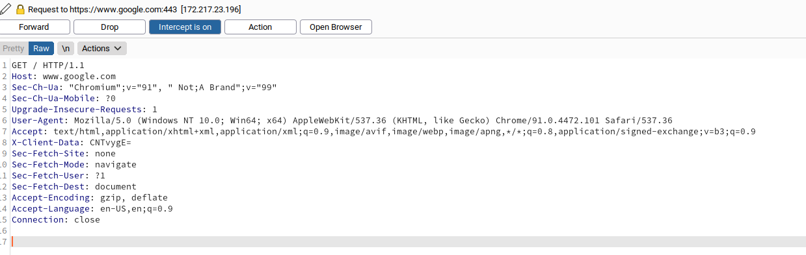

## Introduction

### HTTP

`HyperText Transfer Protocol`

HTTP is a client-server protocol. The clients sends a `request` to the server and the server `responds` with a `ressource`.

In short we can say a client makes a `request` and the server answers with a `response`.

Resources over HTTP are accessed via a [URL](https://en.wikipedia.org/wiki/URL). A structure of an `url` is as follows:


| Component       | Description                                                  |
| --------------- | ------------------------------------------------------------ |
| Protocol/Scheme | This is used to identify the protocol being accessed by the client. This is usually `http` or `https`. |
| Host            | The resource location. It can be a name (sub-domain + domain name) or an IP address |
| Directory       | It can contain none or more directories.                     |
| File            | A file can be a backend-language file like `php`, `jsp`, `asp`. It can be without extension as well |
| Path            | Directories and files make up the path                       |
| Query String    | The query string is preceded by a question mark (?). It is an optional component that is used to pass information to the resource. A query string consists of a parameter and a value. There can be multiple parameters separated by an ampersand (&). |
| Fragment/Anchor | Used to locate sections within the primary resource          |

#### HTTP FLOW

- client(browser) sends request inf form of an `URL`. If this is the first time a user requests this `URL`, the browser request first a DNS server to resolve the host to an IP address. 
- The browsers sends a `GET` request to the resolved IP
- The server processes the `request` (looks at the headers for more information like the host, path, query string and other)
- the server returns a `response`, for example a `html` page.
- the client (browser) renders the `html`, `css`, `javascript` and displays the page 


### HTTPS

`HTTPS` is practically the same as HTTP but with and additional TLS layer on top of it.

On first contact the server performs an [key exchange](https://www.cloudflare.com/learning/ssl/what-happens-in-a-tls-handshake).  After the key exchange is successful, the flow continues as it would on HTTP. Depending on the circumstances, an attacker may be able to perform an HTTP [downgrade attack](https://en.wikipedia.org/wiki/Downgrade_attack), which downgrades HTTPS communication to HTTP. This is done by setting up a [man-in-the-middle (MITM)](https://en.wikipedia.org/wiki/Man-in-the-middle_attack) attack and proxying (passing) all traffic through the attacker's host  without the user's knowledge.


## Request and Response in Burp

### Request



Using https://www.google.com as an example, we can see a typical request header.
On the first line we see the `GET` method that requests the `/` path using `HTTP/1.1` version of the protocol.
On the next line we see it's asking the host `www.google.com` for the response

### Response


The first line of the response header contains two fields,  the first being the HTTP version, while the second denotes the HTTP response code. After the header we'll get the content which the browser renders and lastly we see.

## Headers

A complete list of standard HTTP headers can be found at [here](https://developer.mozilla.org/en-US/docs/Web/HTTP/Headers).

### General Headers

Don't belong specifically neither to a request or response.

| **Header**   | **Description**                                              |
| ------------ | ------------------------------------------------------------ |
| `Date`       | The `Date` header holds the date and time at which the message originated. It's preferred to convert the time to the standard [UTC](https://en.wikipedia.org/wiki/Coordinated_Universal_Time) time zone. |
| `Connection` | The `Connection` header dictates if the current network  connection should stay alive after the request finishes. Two commonly  used values for this header are `close` and `keep-alive`. The `close` value from either the client or server means that they would like to terminate the connection, while the `keep-alive` header indicates that the connection should remain open. |

```shell-session
Bonzo@htb[/htb]$ curl -I -X GET https://www.inlanefreight.com

<SNIP>
Date: Sun, 06 Aug 2020 08:49:37 GMT
Connection: keep-alive
```


### Entity Headers

Can be common to requests and responses.  These headers are used to describe the content (entity) being transferred by a message. They are usually found ind responses and requests containing `PUT` or `POST` methods (e.g. file uploads).

| **Header**         | **Description**                                              |
| ------------------ | ------------------------------------------------------------ |
| `Content-Type`     | This header is used to describe the type of resource being  transferred. The value is automatically added by the browsers on the  client-side and returned in the server response. |
| `Media-Type`       | The `media-type` describes the data being passed. For example, the media-type for a PDF is `application/pdf`, while the type for a PNG image is `image/png`. This header can play a crucial role in making the server interpret our input. The `charset` field denotes the encoding standard, such as [UTF-8](https://en.wikipedia.org/wiki/UTF-8). |
| `Boundary`         | The `boundary` directive acts as a marker to separate content when there is more than one in the same message. |
| `Content-Length`   | The `Content-Length` header holds the size of the entity  being passed. This header is necessary as the server uses it to read  data from the message body. |
| `Content-Encoding` | Data can undergo multiple transformations before being passed. For  example, large amounts of data can be compressed to reduce the message  size. The type of encoding being used should be specified using the `Content-Encoding` header. |

```shell-session
onzo@htb[/htb]$ curl -I -X GET https://www.inlanefreight.com

<SNIP>
Content-Length: 26012
Content-Type: text/html; charset=ISO-8859-4
Content-Encoding: gzip
```


### Request Headers

| **Header**      | **Description**                                              |
| --------------- | ------------------------------------------------------------ |
| `Host`          | The `Host` header is used to specify the host being  queried for the resource. This can be a domain name or an IP address.  HTTP servers can be configured to host different websites, which are  revealed based on the hostname. This makes the host header an important  enumeration target. |
| `User-Agent`    | The `User-Agent` header is used to describe the client  requesting resources. For example, a browser or a library. This header  can reveal a lot about the client, such as the browser, its version, and the operating system. |
| `Accept`        | The `Accept` header describes which media types the client can understand. It can contain multiple media types separated by commas. The `*/*` value signifies all media types. |
| `Cookie`        | The `Cookie` header should contain cookie-value pairs in the format `name=value`. HTTP is a stateless protocol, meaning the server has no way to identify clients connecting to it. This is a problem when hosting protected  resources and content. A [cookie](https://en.wikipedia.org/wiki/HTTP_cookie) is a piece of data stored on the client and server, which acts as an  identifier. These are passed to the server per request, thus maintaining the client's access. Cookies can also serve other purposes, such as  saving user preferences or session tracking. There can be multiple  cookies in a single header separated by a semi-colon. |
| `Referer`       | The `Referer` header denotes where the current request is coming from. For example, clicking a link from Google search results would make `https://google.com` the referer. Trusting this header can be dangerous as it can be easily manipulated, leading to unintended consequences. |
| `Authorization` | The `Authorization` HTTP header is another way for the  server to identify clients. After successful authentication, the server  returns a token unique to the client. Unlike cookies, tokens are stored  only on the client-side and retrieved by the server per request. There  are multiple types of authentication types based on the webserver and  application type used. |

```shell-session
Bonzo@htb[/htb]$ curl -I -X GET https://www.inlanefreight.com

Host: www.inlanefreight.com
User-Agent: Mozilla/5.0 (Macintosh; Intel Mac OS X 10_14_5) AppleWebKit/605.1.15 (KHTML, like Gecko)
Cookie: cookie1=298zf09hf012fh2; cookie2=u32t4o3tb3gg4
Accept: text/plain
Referer: https://www.hackthebox.eu/
Authorization: BASIC cGFzc3dvcmQK
<SNIP>
```


### Response Headers

| **Header**         | **Description**                                              |
| ------------------ | ------------------------------------------------------------ |
| `Server`           | The `Server` header contains information about the HTTP  server, which handled the request. It can be used to gain information  about the server, such as its version, and enumerate it further. |
| `Set-Cookie`       | The `Set-Cookie` header contains the cookies needed for  client identification. Browsers parse the cookies and store them for  future requests. This header follows the same format as the `Cookie` header. |
| `WWW-Authenticate` | The `WWW-Authenticate` header notifies the client about the type of authentication required to access the requested resource. |

```shell-session
Bonzo@htb[/htb]$ curl -I -X GET https://www.inlanefreight.com

<SNIP>
Server: Apache/2.2.14 (Win32)
Set-Cookie: name1=value1,name2=value2; Expires=Wed, 09 Jun 2021 10:18:14 GMT
WWW-Authenticate: BASIC realm="localhost"
```


### Security Headers

| **Header**                  | **Description**                                              |
| --------------------------- | ------------------------------------------------------------ |
| `Content-Security-Policy`   | The CSP header dictates the website's policy towards externally  injected resources. This could be JavaScript code as well as script  resources. This header instructs the browser to accept resources only  from certain trusted domains, hence preventing attacks such as [Cross-site scripting](https://en.wikipedia.org/wiki/Cross-site_scripting). |
| `Strict-Transport-Security` | The HTTP Strict Transport Security policy of a website prevents the  browser from accessing the website over the plaintext HTTP protocol. All communication is done via the secure HTTPS protocol. This prevents  attackers from sniffing web traffic and accessing protected information  such as passwords or other sensitive data. |
| `Referrer-Policy`           | This header dictates whether the browser should include the value specified via the `Referer` header or not. It can help in avoiding disclosing sensitive URLs and information while browsing the website. |

```shell-session
Bonzo@htb[/htb]$ curl -I -X GET https://www.inlanefreight.com

<SNIP>
Content-Security-Policy: script-src 'self'
Strict-Transport-Security: max-age=31536000
Referrer-Policy: origin
```
